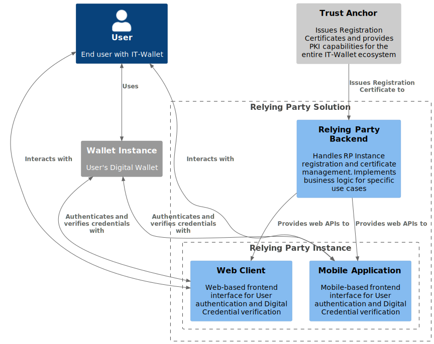

.. include:: ../common/common_definitions.rst

Relying Party Solution
======================

A Relying Party, as an Organizational entity relying upon IT-Wallet, provides Technical Solutions (Relying Party Solution) that could combine software, hardware, services, settings, and configurations, including Relying Party Instances for User authentication and Digital Credential verification.

In order to implement and provide Technical Solutions, a Relying Party could take advantage of services provided by an Intermediary Entity. A Relying Party Intermediary is an Organization Entity that may act on behalf of the Relying Party offering services to it, making the Relying Party able to connect to Wallet Instance and authenticate Users and verify User's Digital Credentials.

A Relying Party provides at least one of the following components:

- **Relying Party Backend**: It handles Relying Party Instances registration and the relative Certificate management. It obtains X.509 Certificate according to the :ref:`trust:The Infrastructure of Trust`. It SHOULD also provide a X.509 Certificate to its Relying Party Instances. It also may implement additional web services and business logic for its own purposes and use cases.
- **Relying Party Instance**: It is a frontend provided to Users in order to access Relying Party Services, and it may be provided as:

  - **Web Client**.
  - **Mobile Application**.

The following diagram depicts the Relying Party Solution High Level Architecture.

7woPSkx_OV94nuJE5Lcm2lQ43FBrx5beZN52mJAWfqzQhhx7QVHjYAKmScSvo9f5MB2OWl4l3w7500-uLI5w4PKri4GVrKP94R73vBnzKJK9nQSSf72YKbf5HOgDzH1t29HHUHm00KhRCKdGiXlRcbhumzIZFYYpBPtmyL1MHpK1UUWkeE0BUBIwPIoJI_XnJcpgNLa9-GrDFVAwwVGdRdU4NJEv0d8JeZ0ImRybojpaG1OQOSGM6-uPv8tJwJK03O0o609ekrKoSGuE9NjnCq2AW85u0ZtfRs3hIdNC_2xN7blFTSHtZrKfjIA9d9-nWcKIZZnPCwi8GmqRdyQq1aM7tmY92IrF3uWsxhXDSk1-gxOg2WrBZpLVqUiB-bIDhlY_XzDOwZ-MmZbAVfy4M3YdJsuCgx_vbyXUizSiUqnZbkPzdsQlBpcN9cc64XzNwIBq6JgBXFdjHdhKALFOAHUo6qKjE-xYECbJQl-PqQzDovcra36anHqPdvLqR9onxVao3rlmvoM6Q3b85sPm7ACiJdjEMbWKUUWypzr6UDzpwpYEcZBAkkZQFtnlZgqcGVRjFolSAEW8qry6lIPURQD_0W00

  Relying Party Solution High Level Architecture

Relying Party Solution Requirements
-----------------------------------

This section lists the requirements to be met by Relying Parties and Relying Party Solutions.

- The Relying Party MUST register with the Federation Authority to obtain both the Access Certificate and the Registration Certificate.
- The Relying Party MUST implement secure mechanisms for handling and processing received Digital Credentials, ensuring the integrity and confidentiality of the Relying Party Solution.
- The Relying Party MUST expose an endpoint for the erasure of personal attributes presented by Users whenever the attributes requested by the Relying Party include a unique identifier of the User (e.g. the "tax_id_code" claim of the PID).
- The Relying Party Solution MUST implement proper revocation procedures for compromised or decommissioned instances.
- The Relying Party Solution MUST maintain an audit trail of Credential verifications while respecting privacy requirements and data protection regulations.
- The Relying Party Solution MUST allow Selective Disclosure mechanisms during presentation scenarios.
- The Relying Party Backend MUST provide a RESTful set of services for registering Relying Party Instances and issuing Access Certificates.
- The Relying Party Instance MUST periodically reestablish trust with the Relying Party through integrity checks and Certificate renewal procedures.
- The Relying Party Instance MUST provide both a Registration Certificate and Access Certificate to Wallet Instances during their interaction to prove the legitimacy and authorization of its requests.
- The Relying Party Instance MUST communicate to Users which attributes are requested and for what purpose during any Credential presentation flow.
- The Mobile Relying Party Instances MUST be compatible and functional on both Android and iOS operating systems and available on the Play Store and App Store, respectively.
- The Mobile Relying Party Instances MUST handle both online and offline presentation scenarios, with appropriate security measures and user notifications.

.. toctree::
  :caption: Relying Party Solution Table of Contents
  :maxdepth: 3

  relying-party-instance.rst
  relying-party-endpoint.rst

