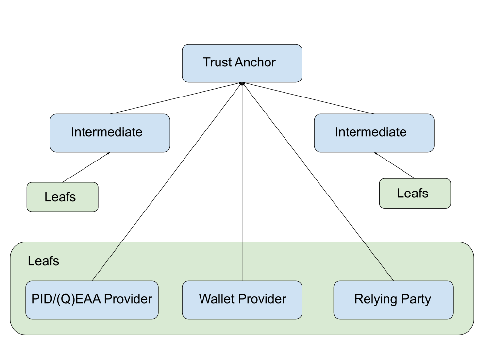
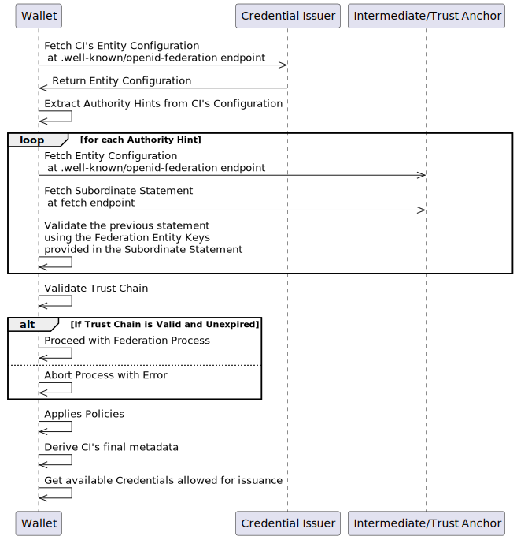
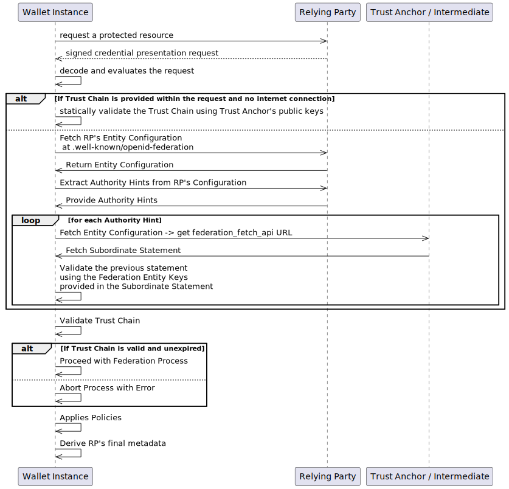

.. include:: ../common/common_definitions.rst
.. include:: ../common/symbols.rst

.. _trust.rst:

The Infrastructure of Trust
+++++++++++++++++++++++++++

This section outlines the implementation of the Trust Model in an infrastructure that complies with OpenID Federation 1.0 `OID-FED`_. This infrastructure involves a RESTful API for distributing metadata, metadata policies, trust marks, cryptographic public keys and X.509 certificates, and the revocation status of the participants, also called Federation Entities.

The Infrastructure of trust facilitates the application of a trust assessment mechanism among the parties defined in the `EIDAS-ARF`_.

    The roles within the Federation, where the Trust Anchor oversees its subordinates,
    which include one or more Intermediates and Leaves. In this
    representation, both the Trust Anchor and the Intermediates assume the role of Registration Authority.

Federation Roles
------------------

All the participants are Federation Entities that MUST be registered by a Registration Body,
except for Wallet Instances which are End-User's personal devices authenticated by their Wallet Provider.

.. note::
    The Wallet Instance, as a personal device, is deemed reliable through a verifiable attestation issued and signed by a trusted third party.

    This is called *Wallet Attestation* and is documented in `the dedicated section  <wallet-attestation.html>`_.

Below the table with the summary of the Federation Entity roles, mapped on the corresponding EUDI Wallet roles, as defined in the `EIDAS-ARF`_.

.. list-table::
   :widths: 20 20 60
   :header-rows: 1

   * - EUDI Role
     - Federation Role
     - Notes
   * - Public Key Infrastructure (PKI)
     - Trust Anchor
     - The Federation has PKI capabilities. The Entity that configures the entire infrastructure is the Trust Anchor.
   * - Qualified Trust Service Provider (QTSP)
     - Leaf
     -
   * - Person Identification Data Provider
     - Leaf
     -
   * - Qualified Electronic Attestations of Attributes Provider
     - Leaf
     -
   * - Electronic Attestations of Attributes Provider
     - Leaf
     -
   * - Relying Party
     - Leaf
     -
   * - Trust Service Provider (TSP)
     - Leaf
     -
   * - Trusted List
     - Trust Anchor
     - The listing endpoint, the trust mark status endpoint, and the fetch endpoint MUST be exposed by both Trust Anchors and Intermediates, making the Trusted List distributed over multiple Federation Entities, where each of these is responsible for their registered subordinates. Other endpoints using different data formats MAY be implemented to facilitate interoperability with systems that do not support OpenID Federation 1.0. In such cases, the same information about federation entities MUST be synchronized across these endpoints, ensuring consistent availability of information through different channels.
   * - Wallet Provider
     - Leaf
     -

General Properties
------------------

The architecture of the trust infrastructure is built upon the following core principles:

.. list-table::
   :header-rows: 1

   * - Identifier
     - Property
     - Description
   * - P1
     - **Security**
     - Incorporates mechanisms to ensure the integrity, confidentiality, and authenticity of the trust relationships and interactions within the federation.
   * - P2
     - **Privacy**
     - Designed to respect and protect the privacy of the entities and individuals involved, minimal disclosure is part of this.
   * - P3
     - **Interoperability**
     - Supports seamless interaction and trust establishment between diverse systems and entities within the federation.
   * - P4
     - **Transitive Trust**
     - Trust established indirectly through a chain of trusted relationships, enabling entities to trust each other based on common authorities and trusted intermediaries.
   * - P5
     - **Delegation**
     - Technical ability/feature to delegate authority or responsibilities to other entities, allowing for a distributed trust mechanism.
   * - P6
     - **Scalability**
     - Designed to efficiently manage an increasing number of entities or interactions without a significant increase in trust management complexity.
   * - P7
     - **Flexibility**
     - Adaptable to various operational and organizational needs, allowing entities to define and adjust their trust relationships and policies.
   * - P8
     - **Autonomy**
     - While part of a federated ecosystem, each entity retains control over its own definitions and configurations.
   * - P9
     - **Decentralization**
     - Unlike traditional centralized systems, the trust infrastructure should allow a decentralized approach.

Trust Infrastructure Requirements
---------------------------------

This section includes the requirements necessary for the successful implementation and operation of the infrastructure of trust.

.. list-table:: Functional Requirements
   :header-rows: 1

   * - ID
     - Description
   * - FR1
     - **Federation Trust Establishment**: the system must be able to establish trust between different entities (Credential Issuers, Relying Parties, etc.) within a federation, using cryptographic signatures for secure information exchange about the participants in the ecosystem.
   * - FR2
     - **Entity Authentication**: the system must implement mechanisms for authenticating entities within the federation, ensuring compliance with the shared rules.
   * - FR3
     - **Signature Validation**: the system must support the creation, verification, and validation of electronic signatures and provide standard and secure mechanisms to obtain the cryptographic public keys required for the signature validation.
   * - FR4
     - **Time Stamping**: the signed artifacts must contain time stamps to ensure the integrity and non-repudiation of transactions over time, thanks to the interfaces, services, storage model and approaches defined within the federation.
   * - FR5
     - **Certificate Validation**: the system requires confidential transmission, secured via TLS over HTTP, and validation of certificates for website authentication.
   * - FR6
     - **Interoperability and Standards Compliance**: ensure interoperability between federation members by adhering to technical standards, facilitating cross-border electronic transactions.
   * - FR7
     - **Data Protection and Privacy**: implement data protection measures in compliance with GDPR regulations, ensuring the privacy and security of personal data processed within the federation.
   * - FR8
     - **Dispute Resolution and Liability**: establish clear procedures for dispute resolution and define liability among federation members.
   * - FR9
     - **Emergency and Revocation Services**: implement mechanisms for the immediate revocation of participants in case of security breaches or other emergencies.
   * - FR10
     - **Scalable Trust Infrastructure**: the system must support scalable trust establishment mechanisms, leveraging approaches and technical solutions that complement delegation transitive approaches to efficiently manage trust relationships as the federation grows, removing central registries that might technically or administratively fail.
   * - FR11
     - **Efficient Storage Scalability**: implement a storage solution that scales horizontally to accommodate increasing data volumes while minimizing central storage and administrative costs. The system should enable members to independently store and present historical trust attestations and signed artifacts during dispute resolutions, with the federation infrastructure maintaining only a registry of historical keys to validate the historical data, stored and provided by the participants.
   * - FR12
     - **Verifiable Attestation (Trust Mark)**: incorporate a mechanism for issuing and verifying verifiable attestations that serve as proof of compliance with specific profiles or standards. This allows entities within the federation to demonstrate adherence to agreed-upon security, privacy, and operational standards.
   * - FR13
     - **Decentralized Dispute Resolution Mechanism**: design a decentralized mechanism for dispute resolution that allows federation members to independently verify historical trust establishment and signed artifacts, reducing reliance on central authorities and streamlining the resolution process.
   * - FR14
     - **Cross-Federation Interoperability**: ensure the system is capable of interoperating with other federations or trust frameworks, facilitating cross-federation transactions and trust establishment without compromising security or compliance.
   * - FR15
     - **Autonomous Registration Bodies**: the system must facilitate the integration of autonomous registration bodies that operate in compliance with federation rules. These bodies are tasked with evaluating and registering entities within the federation, according to the pre-established rules and their compliance that must be periodically asserted.
   * - FR16
     - **Periodic Auditing of Registration Bodies and Entities**: implement mechanisms for the periodic auditing and monitoring of the compliance status of both registration bodies and their registered entities.
   * - FR17
     - **Attestation of Compliance for Personal Devices**: trusted bodies, in the form of federation entities, should issue attestations of compliance and provide signed proof of such compliance for the hardware of personal devices used within the federation. These attestations should be attested and periodically renewed to ensure the devices meet current security standards.
   * - FR18
     - **Automated Compliance Monitoring**: the system should include automated tools for monitoring the compliance of entities with federation standards. This automation aids in the early detection of potential compliance issues.
   * - FR19
     - **Secure Protocol Capabilities Binding**: the secure protocol must enable the exchange of protocol-specific capabilities data as cryptographically-bound metadata attached to a specific identity. This metadata should define the technical capabilities associated with the identity, ensuring verifiable proof and tamper-proof association for robust trust establishment and access control.

Federation API endpoints
------------------------

OpenID Federation 1.0 uses RESTful Web Services secured over
HTTPs. OpenID Federation 1.0 defines which are the web endpoints that the participants MUST make
publicly available. The table below summarises the endpoints and their scopes.

All the endpoints listed below are defined in the `OID-FED`_ specs.

.. list-table::
   :widths: 20 20 20 20
   :header-rows: 1

   * - endpoint name
     - http request
     - scope
     - required for
   * - federation metadata
     - **GET** .well-known/openid-federation
     - Metadata that an Entity publishes about itself, verifiable with a trusted third party (Superior Entity). It's called Entity Configuration.
     - Trust Anchor, Intermediate, Wallet Provider, Relying Party, Credential Issuer
   * - subordinate list endpoint
     - **GET** /list
     - Lists the Subordinates.
     - Trust Anchor, Intermediate
   * - fetch endpoint
     - **GET** /fetch?sub=https://rp.example.org
     - Returns a signed JWT about a specific subject, its Subordinate. It's called Subordinate Statement.
     - Trust Anchor, Intermediate
   * - trust mark status
     - **POST** /status?sub=...&trust_mark_id=...
     - Returns the status of the issuance (validity) of a Trust Mark related to a specific subject.
     - Trust Anchor, Intermediate
   * - historical keys
     - **GET** /historical-jwks
     - Lists the expired and revoked keys, with the motivation of the revocation.
     - Trust Anchor, Intermediate

All the responses of the federation endpoints are in the form of signed JWT, with the exception of the **Subordinate Listing endpoint** and the **Trust Mark Status endpoint** that are served as plain JSON by default.

Configuration of the Federation
-------------------------------

The configuration of the federation is published by the Trust Anchor within its Entity Configuration, it is available at the well-known web path corresponding to **.well-known/openid-federation**.

All the participants in the federation MUST obtain the federation configuration before entering the operational phase, and they
MUST keep it up-to-date. The federation configuration is the Trust Anchor's Entity Configuration, it contains the
public keys for signature operations.

Below is a non-normative example of a Trust Anchor Entity Configuration, where each parameter is documented in the `OpenID Federation <OID-FED>`_ specification:

.. code-block:: text

    {
        "alg": "ES256",
        "kid": "FifYx03bnosD8m6gYQIfNHNP9cM_Sam9Tc5nLloIIrc",
        "typ": "entity-statement+jwt"
    }
    .
    {
        "exp": 1649375259,
        "iat": 1649373279,
        "iss": "https://trust-registry.eid-wallet.example.it",
        "sub": "https://trust-registry.eid-wallet.example.it",
        "jwks": {
            "keys": [
                {

                    "kty": "EC",
                    "kid": "X2ZOMHNGSDc4ZlBrcXhMT3MzRmRZOG9Jd3o2QjZDam51cUhhUFRuOWd0WQ",
                    "crv": "P-256",
                    "x": "1kNR9Ar3MzMokYTY8BRvRIue85NIXrYX4XD3K4JW7vI",
                    "y": "slT14644zbYXYF-xmw7aPdlbMuw3T1URwI4nafMtKrY"
                }
            ]
        },
        "metadata": {
            "federation_entity": {
                "organization_name": "example TA",
                "contacts":[
                    "tech@eid.trust-anchor.example.eu"
                ],
                "homepage_uri": "https://trust-registry.eid-wallet.example.it",
                "logo_uri":"https://trust-registry.eid-wallet.example.it/static/svg/logo.svg",
                "federation_fetch_endpoint": "https://trust-registry.eid-wallet.example.it/fetch",
                "federation_resolve_endpoint": "https://trust-registry.eid-wallet.example.it/resolve",
                "federation_list_endpoint": "https://trust-registry.eid-wallet.example.it/list",
                "federation_trust_mark_status_endpoint": "https://trust-registry.eid-wallet.example.it/trust_mark_status"
            }
        },
        "trust_mark_issuers": {
            "https://trust-registry.eid-wallet.example.it/openid_relying_party/public": [
                "https://trust-registry.eid-wallet.example.it",
                "https://public.intermediary.other.org"
            ],
            "https://trust-registry.eid-wallet.example.it/openid_relying_party/private": [
                "https://private.other.intermediary.org"
            ]
        }
    }

Entity Configuration
--------------------

The Entity Configuration is the verifiable document that each Federation Entity MUST publish on its own behalf, in the **.well-known/openid-federation** endpoint.

The Entity Configuration HTTP Response MUST set the media type to `application/entity-statement+jwt`.

The Entity Configuration MUST be cryptographically signed. The public part of this key MUST be provided in the
Entity Configuration and within the Subordinate Statement issued by a immediate superior and related to its subordinate Federation Entity.

The Entity Configuration MAY also contain one or more Trust Marks.

.. note::
  **Entity Configuration Signature**

  All the signature-check operations regarding the Entity Configurations, Subordinate Statements and Trust Marks, are carried out with the Federation public keys. For the supported algorithms refer to Section `Cryptografic Algorithm`.

Entity Configurations Common Parameters
^^^^^^^^^^^^^^^^^^^^^^^^^^^^^^^^^^^^^^^

The Entity Configurations of all the participants in the federation MUST have in common the parameters listed below.

.. list-table::
   :widths: 20 60
   :header-rows: 1

   * - **Claim**
     - **Description**
   * - **iss**
     - String. Identifier of the issuing Entity.
   * - **sub**
     - String. Identifier of the Entity to which it is referred. It MUST be equal to ``iss``.
   * - **iat**
     - UNIX Timestamp with the time of generation of the JWT, coded as NumericDate as indicated at :rfc:`7519`.
   * - **exp**
     - UNIX Timestamp with the expiry time of the JWT, coded as NumericDate as indicated at :rfc:`7519`.
   * - **jwks**
     - A JSON Web Key Set (JWKS) :rfc:`7517` that represents the public part of the signing keys of the Entity at issue. Each JWK in the JWK set MUST have a key ID (claim kid) and MAY have a `x5c` parameter, as defined in :rfc:`7517`. It contains the Federation Entity Keys required for the operations of trust evaluation.
   * - **metadata**
     - JSON Object. Each key of the JSON Object represents a metadata type identifier
       containing JSON Object representing the metadata, according to the metadata
       schema of that type. An Entity Configuration MAY contain more metadata statements, but only one for each type of
       metadata (<**entity_type**>). the metadata types are defined in the section `Metadata Types <Metadata Types>`_.

Entity Configuration Trust Anchor
^^^^^^^^^^^^^^^^^^^^^^^^^^^^^^^^^

The Trust Anchor Entity Configuration, in addition to the common parameters listed above, uses the following parameters:

.. list-table::
   :widths: 20 60 20
   :header-rows: 1

   * - **Claim**
     - **Description**
     - **Required**
   * - **trust_mark_issuers**
     - JSON Array that defines which Federation authorities are considered trustworthy
       for issuing specific Trust Marks, assigned with their unique identifiers.
     - |uncheck-icon|
   * - **trust_mark_owners**
     - JSON Array that lists which entities are considered to be the owners of
       specific Trust Marks.
     - |uncheck-icon|

Entity Configuration Leaves and Intermediates
^^^^^^^^^^^^^^^^^^^^^^^^^^^^^^^^^^^^^^^^^^^^^^^^

In addition to the previously defined claims, the Entity Configuration of the Leaves and of the Intermediate Entities uses the following parameters:

.. list-table::
   :widths: 20 60 20
   :header-rows: 1

   * - **Claim**
     - **Description**
     - **Required**
   * - **authority_hints**
     - Array of URLs (String). It contains a list of URLs of the immediate superior entities, such as the Trust Anchor or
       an Intermediate, that issues an Subordinate Statement related to this subject.
     - |check-icon|
   * - **trust_marks**
     - A JSON Array containing the Trust Marks.
     - |uncheck-icon|

Metadata Types
^^^^^^^^^^^^^^^^

In this section are defined the main metadata types mapped to the roles of the ecosystem,
giving the references of the metadata protocol for each of these.

.. note::

    The entries that don't have any reference to a known draft or standard are intended to be defined in this technical reference.

.. list-table::
   :widths: 20 20 20 60
   :header-rows: 1

   * - OpenID Entity
     - EUDI Entity
     - Metadata Type
     - References
   * - Trust Anchor
     - Trust Anchor
     - ``federation_entity``
     - `OID-FED`_
   * - Intermediate
     - Intermediate
     - ``federation_entity``
     - `OID-FED`_
   * - Wallet Provider
     - Wallet Provider
     - ``federation_entity``, ``wallet_provider``
     - --
   * - Authorization Server
     -
     - ``federation_entity``, ``oauth_authorization_server``
     - `OPENID4VCI`_
   * - Credential Issuer
     - PID Provider, (Q)EAA Provider
     - ``federation_entity``, ``openid_credential_issuer``, [``oauth_authorization_server``]
     - `OPENID4VCI`_
   * - Relying Party
     - Relying Party
     - ``federation_entity``, ``openid_credential_verifier``
     - `OID-FED`_, `OpenID4VP`_

.. note::
    Wallet Provider metadata is defined in the section below.

    `Wallet Solution section <wallet-solution.html>`_.

.. note::
    In instances where a PID/EAA Provider implements both the Credential Issuer and the Authorization Server,
    it MUST incorporate both
    ``oauth_authorization_server`` and ``openid_credential_issuer`` within its metadata types.
    Other implementations may divide the Credential Issuer from the Authorization Server, when this happens the Credential Issuer metadata MUST contain the `authorization_servers` parameters, including the Authorization Server unique identifier.
    Furthermore, should there be a necessity for User Authentication by the Credential Issuer,
    it could be necessary to include the relevant metadata type, either ``openid_relying_party``
    or ``openid_credential_verifier``.

Metadata of federation_entity Leaves
-------------------------------------

The *federation_entity* metadata for Leaves MUST contain the following claims.

.. list-table::
  :widths: 20 60
  :header-rows: 1

  * - **Claim**
    - **Description**
  * - **organization_name**
    - See `OID-FED`_ Draft 41 Section 5.2.2
  * - **homepage_uri**
    - See `OID-FED`_ Draft 41 Section 5.2.2
  * - **policy_uri**
    - See `OID-FED`_ Draft 41 Section 5.2.2
  * - **logo_uri**
    - URL of the entity's logo; it MUST be in SVG format. See `OID-FED`_ Draft 36 Section 5.2.2
  * - **contacts**
    - Institutional certified email address (PEC) of the entity. See `OID-FED`_ Draft 36 Section 5.2.2
  * - **federation_resolve_endpoint**
    - See `OID-FED`_ Draft 41 Section 5.1.1

Subordinate Statements
-----------------------

Trust Anchors and Intermediates publish Subordinate Statements related to their immediate Subordinates.
The Subordinate Statement MAY contain a metadata policy and the Trust Marks related to a Subordinate.

The metadata policy, when applied, makes one or more changes to the final metadata of the Leaf. The final metadata of a Leaf is derived from the Trust Chain that contains all the statements, starting from the Entity Configuration up to the Subordinate Statement issued by the Trust Anchor.

Trust Anchors and Intermediates MUST expose the Federation Fetch endpoint, where the Subordinate Statements are requested to validate the Leaf's Entity Configuration signature.

.. note::
    The Federation Fetch endpoint MAY also publish X.509 certificates for each of the public keys of the Subordinate. Making the distribution of the issued X.509 certificates via a RESTful service.

Below there is a non-normative example of an Subordinate Statement issued by an Registration Body (such as the Trust Anchor or its Intermediate) in relation to one of its Subordinates.

.. code-block:: text

    {
        "alg": "ES256",
        "kid": "em3cmnZgHIYFsQ090N6B3Op7LAAqj8rghMhxGmJstqg",
        "typ": "entity-statement+jwt"
    }
    .
    {
        "exp": 1649623546,
        "iat": 1649450746,
        "iss": "https://intermediate.example.org",
        "sub": "https://rp.example.it",
        "jwks": {
            "keys": [
                {
                    "kty": "EC",
                    "kid": "2HnoFS3YnC9tjiCaivhWLVUJ3AxwGGz_98uRFaqMEEs",
                    "crv": "P-256",
                    "x": "1kNR9Ar3MzMokYTY8BRvRIue85NIXrYX4XD3K4JW7vI",
                    "y": "slT14644zbYXYF-xmw7aPdlbMuw3T1URwI4nafMtKrY",
                    "x5c": [ <X.509 certificate> ]
                }
            ]
        },
        "metadata_policy": {
            "openid_credential_verifier": {
                "scope": {
                    "subset_of": [
                         "eu.europa.ec.eudiw.pid.1",
                         "given_name",
                         "family_name",
                         "email"
                      ]
                },
                "vp_formats": {
                    "dc+sd-jwt": {
                        "sd-jwt_alg_values": [
                            "ES256",
                            "ES384"
                        ],
                        "kb-jwt_alg_values": [
                            "ES256",
                            "ES384"
                        ]
                    }
                }
            }
         }
    }

.. note::

  **Subordinate Statement Signature**

  The same considerations and requirements made for the Entity Configuration
  and in relation to the signature mechanisms MUST be applied for the Subordinate Statements.

Subordinate Statement
^^^^^^^^^^^^^^^^^^^^^

The Subordinate Statement issued by Trust Anchors and Intermediates contains the following attributes:

.. list-table::
   :widths: 20 60 20
   :header-rows: 1

   * - **Claim**
     - **Description**
     - **Required**
   * - **iss**
     - See `OID-FED`_ Section 3 for further details.
     - |check-icon|
   * - **sub**
     - See `OID-FED`_ Section 3 for further details.
     - |check-icon|
   * - **iat**
     - See `OID-FED`_ Section 3 for further details.
     - |check-icon|
   * - **exp**
     - See `OID-FED`_ Section 3 for further details.
     - |check-icon|
   * - **jwks**
     - Federation JWKS of the *sub* entity. See `OID-FED`_ Section 3 for further details.
     - |check-icon|
   * - **metadata_policy**
     - JSON Object that describes the Metadata policy. Each key of the JSON Object represents an identifier of the metadata type and each value MUST be a JSON Object that represents the metadata policy according to that metadata type. Please refer to the `OID-FED`_ specifications, Section 6.1, for the implementation details.
     - |uncheck-icon|
   * - **trust_marks**
     - JSON Array containing the Trust Marks issued by itself for the subordinate subject.
     - |uncheck-icon|
   * - **constraints**
     - It MAY contain the **allowed_leaf_entity_types**, that restricts what types of metadata the subject is allowed to publish. It MAY contain the maximum number of Intermediates allowed between a itself and the Leaf (**max_path_length**)
     - |check-icon|

Trust Evaluation Mechanism
--------------------------

Trust Anchors MUST distribute their Federation Public Keys through secure out-of-band mechanisms, such as publishing them on a verified web page or storing them in a remote repository as part of a trust list. The rationale behind this requirement is that relying solely on the data provided within the Trust Anchor's Entity Configuration does not adequately mitigate risks associated with DNS and TLS manipulation attacks. To ensure security, all participants MUST obtain the Trust Anchor's public keys using these out-of-band methods. They should then compare these keys with those obtained from the Trust Anchor's Entity Configuration, discarding any keys that do not match. This process helps to ensure the integrity and authenticity of the Trust Anchor's public keys and the overall security of the federation.

The Trust Anchor publishes the list of its Subordinates (Federation Subordinate Listing endpoint) and the attestations of their metadata and public keys (Subordinate Statements).

Each participant, including Trust Anchor, Intermediate, Credential Issuer, Wallet Provider, and Relying Party, publishes its own metadata and public keys (Entity Configuration endpoint) in the well-known web resource **.well-known/openid-federation**.

Each of these can be verified using the Subordinate Statement issued by a superior, such as the Trust Anchor or an Intermediate.

Each Subordinate Statement is verifiable over time and MUST have an expiration date. The revocation of each statement is verifiable in real time and online (only for remote flows) through the federation endpoints.

.. note::
    The revocation of an Entity is made with the unavailability of the Subordinate Statement related to it. If the Trust Anchor or its Intermediate doesn't publish a valid Subordinate Statement, or if it publishes an expired/invalid Subordinate Statement, the subject of the Subordinate Statement MUST be intended as not valid or revoked.

The concatenation of the statements, through the combination of these signing mechanisms and the binding of claims and public keys, forms the Trust Chain.

The Trust Chains can also be verified offline, using one of the Trust Anchor's public keys.

.. note::
    Since the Wallet Instance is not a Federation Entity, the Trust Evaluation Mechanism related to it **requires the presentation of the Wallet Attestation during the credential issuance and presentation phases**.

    The Wallet Attestation conveys all the required information pertaining to the instance, such as its public key and any other technical or administrative information, without any User's personal data.

Establishing Trust with Credential Issuers
^^^^^^^^^^^^^^^^^^^^^^^^^^^^^^^^^^^^^^^^^^

In the issuance process, trust evaluation ensures the integrity and authenticity of the Credentials being issued and the realiability of their Issuers. This section delineates the trust evaluation mechanisms distinct from the protocol flows, implemented by Wallet Instances and Relying Parties, as described in the dedicated section.

Trust evaluations implement different ways, as defined below:

* **Federation Entity Discovery**: Wallet Instances and Relying Parties MUST verify the identity of the Issuer through a Federation Entity Discovery process. This involves querying a trusted list or directory to confirm the Issuer's validity status and compliance with the Trust Framework.

* **Trust Chains**: Wallet Instances and Relying Parties evaluate Issuer's Trust Chains, be provided statically or build though a Federation Entity Discovery process, to ensure that the entity requesting the Credential is part of a recognized and trusted federation. This involves checking the Trust Chain from the root authority to the Issuer.

* **Trust Marks Evaluation**: Trust Marks are assessed to ensure ongoing compliance with federation policies. These marks indicate adherence to specific standards and practices required by the federation.

* **Policy Evaluation**: Wallet Instances and Relying Parties MUST check that the Credential Issuer is allowed in the issuance of the Credential of their interest. Metadata, metadata policies and Trust Marks are used for the implementation of these checks.

In the process represented in the sequence diagram below, the Wallet Instance uses the Federation API to discover and collect all the Credential Issuers enabled within the federation. The discovery process produces the Trust Chain. When the Trust Chain is provided statically within a signed request or Credential, it only REQUIRES to be refreshed when the internet connection is available, while it MUST be refreshed when the statically provided Trust Chain results as expired.

QTi8LV2ChAcUr9p5cVljiYdsDMgn6VPtvKgqP1erZI_YF8yIOO8WAXBN3wPY3-XmTqctdhk-jkMo-BuzHFGiQmRsXqKXYJJrCm99Y_W8_CR1_dROTGLBQSomPyfkgP9QdwUtjts1peQ_qaXyaQTop9myi4tSsaoFnplqlGBiqcnsoE8V1e1kEzu1pOm75mm-XvyHAVgdNdSQUoCE1RNUKlEtdx2XaMffTr_msaysmLOsws66TKc3AS1S3ztLnZlb4odjgbsfWmG0Z6NeqF4T_9WFS8mTy30Hlls262iG3-UaISiu5fITtG-BB6Fu0

.. note::
  As shown in the figure, the trust evaluation process is entirely separate and distinct from the protocol-specific flow. It operates in a different flow and utilizes specialized protocols designed specifically for this purpose.

Establishing Trust with Relying Party
^^^^^^^^^^^^^^^^^^^^^^^^^^^^^^^^^^^^^

In the context of evaluating Relying Parties, the responsibility for trust evaluation lies solely with the Wallet Instance.
The trust evaluation mechanisms are distinct from protocol flows and are implemented by the Wallet Instance, as detailed in the dedicated section.

Trust evaluations are conducted as follows:

* **Federation Entity Discovery**: When the Wallet Instance receives a signed request issued by a Relying Party, the Wallet Instance MUST verify the identity of the Relying Party through a Federation Entity Discovery process. This involves querying a trusted list or directory to confirm the Relying Party's validity status and compliance with the Trust Framework and the evaluation of the request signature using the cryptographic material obtained from the Trust Chain.

* **Trust Chains**: The Wallet Instance evaluates the Relying Party's Trust Chains, which may be provided statically or built through a Federation Entity Discovery process, to ensure that the Relying Party is part of a recognized and trusted federation. This involves checking the Trust Chain from the root authority (Trust Anchor) to the Relying Party.

* **Trust Marks Evaluation**: Trust Marks are assessed to ensure ongoing compliance with federation policies. These marks indicate adherence to specific standards and practices required by the federation. Relying Parties MAY include Trust Marks in their Entity Configuration to signal administrative properties and compliance to specific profiles, such as the grants in interacting with under-age users.

* **Policy Evaluation**: The Wallet Instance MUST verify that the Relying Party is authorized to request the Credential of interest. Metadata, metadata policies, and Trust Marks are used to implement these checks.

In the process depicted in the sequence diagram below, the Wallet Instance uses the Federation API to discover and collect all the Relying Parties enabled within the federation. The discovery process produces the Trust Chain. When the Trust Chain is provided statically within a signed request, it only needs to be refreshed when an internet connection is available, but it MUST be refreshed if the statically provided Trust Chain is expired.

eAaSPE4Thdb9vSj4Je7YWBOQ2IXbqJHya3GPhJGlLtkqQMO3pNkwMFNbuOrsp7ERqR1A1HIa9ARWeGcwlhG7xJP1bfxApu0vC5NjKwYiSYYXv_nw7NVzaiifBO0UljCiDXKpZ1MlllvAwDImNbdOdohg3soWjhqhg-_WaW0gVtoY4sQl4DxcC7GdxMKkU4WvsZ6hKmfAq91bbRiwfkdlNXCui5JLB-znlB9gXJN5JnHvpdP6mg6zqIbNBXnWxQ6C2GhS-WVI0SOqsxKFdngmP15QayD6ZvtOFViQEuTVovy1iDAEIA_DzUOd9iw0ItAjzDtHUr2dDu-7GT8cs74k6F50zIHqUkxMAWzB1q0_QvIVvD-1rkCze8l5Dqt-cApiQvV_iM1tzVfkAq7l7YVpK1RAdTqHrEmyirdYkkp6LQsx6TSYiZ7SfnJJPyxph0bE6HGpixC-Kd2-KU4jru5iM3B0XHO-ApGs9Bvlm5m00

.. note::
  As shown in the figure, internet connection is required to update the Trust Chain about an RP and check its revocation status.

Evaluating Trust with Wallets
^^^^^^^^^^^^^^^^^^^^^^^^^^^^^^

The Wallet Provider issues the Wallet Attestation, certifying the operational status of its Wallet Instances and including one of their public keys.

The Wallet Attestation MAY contain the Trust Chain that attests the reliability for its issuer (Wallet Provider) at the time of issuance.

The Wallet Instance provides its Wallet Attestation within the signed request during the PID issuance phase. The Credential Issuer MUST evaluate the Trust Chain about the Wallet Attestation issuer (formally, the Wallet Provider).

Trust Chain
^^^^^^^^^^^^^^^

The Trust Chain is a sequence of verified statements that validates a participant's compliance with the Federation. It has an expiration date time, beyond which it MUST be renewed to obtain the fresh and updated metadata. The expiration date of the Trust Chain is determined by the earliest expiration timestamp among all the expiration timestamp contained in the statements. No Entity can force the expiration date of the Trust Chain to be higher than the one configured by the Trust Anchor.

Below is an abstract representation of a Trust Chain.

.. code-block:: python

    [
        "EntityConfiguration-as-SignedJWT-selfissued-byLeaf",
        "EntityStatement-as-SignedJWT-issued-byTrustAnchor"
    ]

Below is a non-normative example of a Trust Chain, composed by a JSON Array containing JWTs, with an Intermediate involved.

.. code-block:: python

    [
      "eyJhbGciOiJFUzI1NiIsImtpZCI6Ik5GTTFXVVZpVWxZelVXcExhbWxmY0VwUFJWWTJWWFpJUmpCblFYWm1SSGhLWVVWWVVsZFRRbkEyTkEiLCJ0eXAiOiJhcHBsaWNhdGlvbi9lbnRpdHktc3RhdGVtZW50K2p3dCJ9.eyJleHAiOjE2NDk1OTA2MDIsImlhdCI6MTY0OTQxNzg2MiwiaXNzIjoiaHR0cHM6Ly9ycC5leGFtcGxlLm9yZyIsInN1YiI6Imh0dHBzOi8vcnAuZXhhbXBsZS5vcmciLCJqd2tzIjp7ImtleXMiOlt7Imt0eSI6IkVDIiwia2lkIjoiTkZNMVdVVmlVbFl6VVdwTGFtbGZjRXBQUlZZMlZYWklSakJuUVhabVJIaEtZVVZZVWxkVFFuQTJOQSIsImNydiI6IlAtMjU2IiwieCI6InVzbEMzd2QtcFgzd3o0YlJZbnd5M2x6cGJHWkZoTjk2aEwyQUhBM01RNlkiLCJ5IjoiVkxDQlhGV2xkTlNOSXo4a0gyOXZMUjROMThCa3dHT1gyNnpRb3J1UTFNNCJ9XX0sIm1ldGFkYXRhIjp7Im9wZW5pZF9yZWx5aW5nX3BhcnR5Ijp7ImFwcGxpY2F0aW9uX3R5cGUiOiJ3ZWIiLCJjbGllbnRfaWQiOiJodHRwczovL3JwLmV4YW1wbGUub3JnLyIsImNsaWVudF9yZWdpc3RyYXRpb25fdHlwZXMiOlsiYXV0b21hdGljIl0sImp3a3MiOnsia2V5cyI6W3sia3R5IjoiRUMiLCJraWQiOiJORk0xV1VWaVVsWXpVV3BMYW1sZmNFcFBSVlkyVlhaSVJqQm5RWFptUkhoS1lVVllVbGRUUW5BMk5BIiwiY3J2IjoiUC0yNTYiLCJ4IjoidXNsQzN3ZC1wWDN3ejRiUllud3kzbHpwYkdaRmhOOTZoTDJBSEEzTVE2WSIsInkiOiJWTENCWEZXbGROU05JejhrSDI5dkxSNE4xOEJrd0dPWDI2elFvcnVRMU00In1dfSwiY2xpZW50X25hbWUiOiJOYW1lIG9mIGFuIGV4YW1wbGUgb3JnYW5pemF0aW9uIiwiY29udGFjdHMiOlsib3BzQHJwLmV4YW1wbGUuaXQiXSwiZ3JhbnRfdHlwZXMiOlsicmVmcmVzaF90b2tlbiIsImF1dGhvcml6YXRpb25fY29kZSJdLCJyZWRpcmVjdF91cmlzIjpbImh0dHBzOi8vcnAuZXhhbXBsZS5vcmcvb2lkYy9ycC9jYWxsYmFjay8iXSwicmVzcG9uc2VfdHlwZXMiOlsiY29kZSJdLCJzY29wZSI6ImV1LmV1cm9wYS5lYy5ldWRpdy5waWQuMSBldS5ldXJvcGEuZWMuZXVkaXcucGlkLml0LjEgZW1haWwiLCJzdWJqZWN0X3R5cGUiOiJwYWlyd2lzZSJ9LCJmZWRlcmF0aW9uX2VudGl0eSI6eyJmZWRlcmF0aW9uX3Jlc29sdmVfZW5kcG9pbnQiOiJodHRwczovL3JwLmV4YW1wbGUub3JnL3Jlc29sdmUvIiwib3JnYW5pemF0aW9uX25hbWUiOiJFeGFtcGxlIFJQIiwiaG9tZXBhZ2VfdXJpIjoiaHR0cHM6Ly9ycC5leGFtcGxlLml0IiwicG9saWN5X3VyaSI6Imh0dHBzOi8vcnAuZXhhbXBsZS5pdC9wb2xpY3kiLCJsb2dvX3VyaSI6Imh0dHBzOi8vcnAuZXhhbXBsZS5pdC9zdGF0aWMvbG9nby5zdmciLCJjb250YWN0cyI6WyJ0ZWNoQGV4YW1wbGUuaXQiXX19LCJ0cnVzdF9tYXJrcyI6W3siaWQiOiJodHRwczovL3JlZ2lzdHJ5LmVpZGFzLnRydXN0LWFuY2hvci5leGFtcGxlLmV1L29wZW5pZF9yZWx5aW5nX3BhcnR5L3B1YmxpYy8iLCJ0cnVzdF9tYXJrIjoiZXlKaCBcdTIwMjYifV0sImF1dGhvcml0eV9oaW50cyI6WyJodHRwczovL2ludGVybWVkaWF0ZS5laWRhcy5leGFtcGxlLm9yZyJdfQ.Un315HdckvhYA-iRregZAmL7pnfjQH2APz82blQO5S0sl1JR0TEFp5E1T913g8GnuwgGtMQUqHPZwV6BvTLA8g",
      "eyJhbGciOiJFUzI1NiIsImtpZCI6IlNURkRXV2hKY0dWWFgzQjNSVmRaYWtsQ0xUTnVNa000WTNGNlFUTk9kRXRyZFhGWVlYWjJjWGN0UVEiLCJ0eXAiOiJhcHBsaWNhdGlvbi9lbnRpdHktc3RhdGVtZW50K2p3dCJ9.eyJleHAiOjE2NDk2MjM1NDYsImlhdCI6MTY0OTQ1MDc0NiwiaXNzIjoiaHR0cHM6Ly9pbnRlcm1lZGlhdGUuZWlkYXMuZXhhbXBsZS5vcmciLCJzdWIiOiJodHRwczovL3JwLmV4YW1wbGUub3JnIiwiandrcyI6eyJrZXlzIjpbeyJrdHkiOiJFQyIsImtpZCI6Ik5GTTFXVVZpVWxZelVXcExhbWxmY0VwUFJWWTJWWFpJUmpCblFYWm1SSGhLWVVWWVVsZFRRbkEyTkEiLCJjcnYiOiJQLTI1NiIsIngiOiJ1c2xDM3dkLXBYM3d6NGJSWW53eTNsenBiR1pGaE45NmhMMkFIQTNNUTZZIiwieSI6IlZMQ0JYRldsZE5TTkl6OGtIMjl2TFI0TjE4Qmt3R09YMjZ6UW9ydVExTTQifV19LCJtZXRhZGF0YV9wb2xpY3kiOnsib3BlbmlkX3JlbHlpbmdfcGFydHkiOnsic2NvcGUiOnsic3Vic2V0X29mIjpbImV1LmV1cm9wYS5lYy5ldWRpdy5waWQuMSwgIGV1LmV1cm9wYS5lYy5ldWRpdy5waWQuaXQuMSJdfSwicmVxdWVzdF9hdXRoZW50aWNhdGlvbl9tZXRob2RzX3N1cHBvcnRlZCI6eyJvbmVfb2YiOlsicmVxdWVzdF9vYmplY3QiXX0sInJlcXVlc3RfYXV0aGVudGljYXRpb25fc2lnbmluZ19hbGdfdmFsdWVzX3N1cHBvcnRlZCI6eyJzdWJzZXRfb2YiOlsiUlMyNTYiLCJSUzUxMiIsIkVTMjU2IiwiRVM1MTIiLCJQUzI1NiIsIlBTNTEyIl19fX0sInRydXN0X21hcmtzIjpbeyJpZCI6Imh0dHBzOi8vdHJ1c3QtYW5jaG9yLmV4YW1wbGUuZXUvb3BlbmlkX3JlbHlpbmdfcGFydHkvcHVibGljLyIsInRydXN0X21hcmsiOiJleUpoYiBcdTIwMjYifV19._qt5-T6DahP3TuWa_27klE8I9Z_sPK2FtQlKY6pGMPchbSI2aHXY3aAXDUrObPo4CHtqgg3J2XcrghDFUCFGEQ",
      "eyJhbGciOiJFUzI1NiIsImtpZCI6ImVXa3pUbWt0WW5kblZHMWxhMjU1ZDJkQ2RVZERSazQwUWt0WVlVMWFhRFZYT1RobFpHdFdXSGQ1WnciLCJ0eXAiOiJhcHBsaWNhdGlvbi9lbnRpdHktc3RhdGVtZW50K2p3dCJ9.eyJleHAiOjE2NDk2MjM1NDYsImlhdCI6MTY0OTQ1MDc0NiwiaXNzIjoiaHR0cHM6Ly90cnVzdC1hbmNob3IuZXhhbXBsZS5ldSIsInN1YiI6Imh0dHBzOi8vaW50ZXJtZWRpYXRlLmVpZGFzLmV4YW1wbGUub3JnIiwiandrcyI6eyJrZXlzIjpbeyJrdHkiOiJFQyIsImtpZCI6IlNURkRXV2hKY0dWWFgzQjNSVmRaYWtsQ0xUTnVNa000WTNGNlFUTk9kRXRyZFhGWVlYWjJjWGN0UVEiLCJjcnYiOiJQLTI1NiIsIngiOiJyQl9BOGdCUnh5NjhVTkxZRkZLR0ZMR2VmWU5XYmgtSzh1OS1GYlQyZkZJIiwieSI6IlNuWVk2Y3NjZnkxcjBISFhLTGJuVFZsamFndzhOZzNRUEs2WFVoc2UzdkUifV19LCJ0cnVzdF9tYXJrcyI6W3siaWQiOiJodHRwczovL3RydXN0LWFuY2hvci5leGFtcGxlLmV1L2ZlZGVyYXRpb25fZW50aXR5L3RoYXQtcHJvZmlsZSIsInRydXN0X21hcmsiOiJleUpoYiBcdTIwMjYifV19.r3uoi-U0tx0gDFlnDdITbcwZNUpy7M2tnh08jlD-Ej9vMzWMCXOCCuwIn0ZT0jS4M_sHneiG6tLxRqj-htI70g"
    ]

.. note::

    The entire Trust Chain is verifiable by only possessing the Trust Anchor's public keys.

There are events where keys are unavailable to verify the entire trust chain:

 - **Key Change by Credential Issuer**: The Credential Issuer MAY update its cryptographic keys. The cryptographic keys MUST be considered valid if evaluated within their originally designated validity period unless a security reason makes them unusable. The revocation reason MUST be published. Historical cryptographic keys, i.e. unused or revoked public cryptographic keys, MUST be published using the Federation Historical Keys Endpoint.

 - **Change in Credential Types**: If the Credential Issuer changes the Credential **types** issued, for instance deciding not to issue anymore one or more Credential types, the related public cryptographic keys MUST be available for the originally designated validity period.

 - **Credential Issuers Merge**: If a Credential Issuer merges with another, creating a new Organizational Entity or working on behalf of another one using a different hostname or domain, the **previously** available federation configuration and historical keys MUST be kept available at the original Credential Issuer's well-known endpoints.

 - **Credential Issuer Becomes Inactive**: If a Credential Issuer becomes inactive, its **related** Entity Configuration and Federation Historical Entity Endpoint MUST be kept available.

Offline Trust Attestation Mechanisms
^^^^^^^^^^^^^^^^^^^^^^^^^^^^^^^^^^^^^^^

The offline flows do not allow for real-time evaluation of an Entity's status, such as its revocation. At the same time, using short-lived Trust Chains enables the attainment of trust attestations compatible with the required revocation administrative protocols (e.g., a revocation must be propagated in less than 24 hours, thus the Trust Chain must not be valid for more than that period).

Offline Wallet Trust Attestation
~~~~~~~~~~~~~~~~~~~~~~~~~~~~~~~~~~~~~~~~~~~~~~~~~

Given that the Wallet Instance cannot publish its metadata online at the *.well-known/openid-federation* endpoint,
it MUST obtain a Wallet Attestation issued by its Wallet Provider. The Wallet Attestation MUST contain all the relevant information regarding the security capabilities of the Wallet Instance and its protocol related configuration. It SHOULD contain the Trust Chain related to its issuer (Wallet Provider).

Offline Relying Party Metadata
~~~~~~~~~~~~~~~~~~~~~~~~~~~~~~~~~~~~~~~~~~~~~~~~~~~

Since the Federation Entity Discovery is only applicable in online scenarios, it is possible to include the Trust Chain in the presentation requests that the Relying Party may issue for a Wallet Instance.

The Relying Party MUST sign the presentation request, the request SHOULD include the `trust_chain` claim in its JWT header parameters, containing the Federation Trust Chain related to itself.

The Wallet Instance that verifies the request issued by the Relying Party MUST use the Trust Anchor's public keys to validate the entire Trust Chain related to the Relying Party before attesting its reliability.

Furthermore, the Wallet Instance applies the metadata policy, if any.

Trust Chain Fast Renewal
------------------------

The Trust Chain fast renewal method offers a streamlined way to maintain the validity of a trust chain without undergoing the full discovery
process again. It's particularly useful for quickly updating trust relationships when minor changes occur or when the
Trust Chain is close to expiration but the overall structure of the federation hasn't changed significantly.

The Trust Chain fast renewal process is initiated by fetching the leaf's Entity Configuration anew. However, unlike the federation discovery process that may involve fetching Entity Configurations starting from the authority hints, the fast renewal focuses on directly obtaining the Subordinate Statements. These statements are requested using the `source_endpoint` provided within them, which points to the location where the statements can be fetched.

Non-repudiability of the Long Lived Attestations
--------------------------------------------------

The Trust Anchor and its Intermediate MUST expose the Federation Historical Keys endpoint, where are published all the public part of the Federation Entity Keys that are no longer used, whether expired or revoked.

The details of this endpoint are defined in the `OID-FED`_ Section 8.7.

Each JWT containing a Trust Chain in the JWT headers can be verified over time, since the entire Trust Chain is verifiable using the Trust Anchor's public key.

Even if the Trust Anchor has changed its cryptographic keys for digital signature, the Federation Historical Keys endpoint always makes the keys no longer used available for historical signature verifications.

X.509 PKI
---------

The X.509 Public Key Infrastructure (PKI) is a framework designed to create, manage, distribute, use, store, and revoke digital X.509 Certificates. At the heart of X.509 PKI is the concept of a Certificate Authority (CA), which issues digital certificates to entities. These certificates are required for establishing secure communications over networks, including the internet, by enabling encryption and digital signature functionalities. The PKI hierarchy typically involves a root CA at the top, with one or more subordinate CAs beneath, forming a trusted chain. Entities rely on this chain of trust to verify the authenticity of certificates. X.509 standards define the format of public key certificates.

The integration of OpenID Federation 1.0 with the traditional X.509 based PKI (rfc:5280), complemented by a RESTful API, aims to enhance the infrastructure with additional features, making it navigable and transparent.

This approach leverages the dynamic and flexible nature of OpenID Federation alongside the requirement of the X.509 Certificates for legacy applications and interoperability purposes, aiming to addresses the evolving needs of verification of the registration status of the federation participants, their compliance to the shared rules and the general and interoperable trust management in multilateral digital ecosystems.

OpenID Federation and X.509 based PKI share several things in common, as listed below:

- **Hierarchical Approach**: both utilize a hierarchical trust model with a single, overarching trusted third party, known as the Trust Anchor, which is trusted above all others.
- **Decentralization with Multiple Trust Anchors and Intermediates**: despite a unique hierarchical model, the possibility of having multiple Trust Anchors and Intermediates, below one or more Trust Anchors, introduces a level of decentralization.
- **Custom Extensions**: both systems allow for custom extensions to meet specific requirements or to enhance functionality. X.509 Certificates support custom extensions, OpenID Federation allows definition of custom protocol specific metadata, Trust Marks and policies using a policy language.
- **Trust/Certificate Chain**: they rely on a chained proof of trust, where trust is passed down from the root authority (Trust Anchor) through Intermediaries to the end entity (Leaf).
- **Constraints in the Chain**: constraints can be applied within the Trust Chain regarding critical aspects such as the delegation of trust, the number of intermediaries, and the domains involved.
- **Public Key Distribution**: Both systems involve the distribution of the public key of the Trust Anchor to ensure entities can verify the trust chain.
- **Registry of Expired Keys**: Maintaining a registry of expired keys is crucial for both, ensuring non-repudiation of past signatures even when keys change.

Federation Trust Anchor and X.509 CA
^^^^^^^^^^^^^^^^^^^^^^^^^^^^^^^^^^^^

In the context of OpenID Federation, the Trust Anchor plays a role similar to that of a Certificate Authority (CA) in X.509-based Public Key Infrastructures (PKIs). Both serve as foundational elements of trust within their respective systems. In this document, the term "Trust Anchor" is often used to encompass both concepts. The trust infrastructure described here aligns the OpenID Federation Trust Anchor with the X.509 PKI Certificate Authority, making therefore them a single unique entity supporting both `RFC5280`_ and OpenID Federation 1.0.

X.509 Certificates Issuance
^^^^^^^^^^^^^^^^^^^^^^^^^^^

In an OpenID Federation, each participant is required to self-issue its Entity Configuration, signing it with one of its cryptographic keys that are attested by Immediate Superiors.

In the same way, each federation Entity has the autonomy to issue a signed statement about itself in the form of a X.509 Certificate.
Federation participants that need to issue X.509 Certificates about themselves and for their specific purposes, can issue and sign X.509 Certificates using one of their Federation Entity Keys attested by their Federation Authorities (Immediate Superior). This process aligns the issuance of X.509 Certificates with the federation's delegation paradigm.

This is feasible because the X.509 Certificate can be verified using a X.509 Certificate Chain, similar to the approach used for Entity Configurations in OpenID Federation.

Federation Leaves are not Certificate Authorities (CAs) or CA intermediaries authorized to issue X.509 certificates for their subordinates. Instead, Federation Leaves act as intermediaries for issuing certificates solely about themselves. This is accomplished by applying appropriate naming constraints to ensure that X.509 certificates are correctly scoped.
Naming constraints are applied by Immediate Superiors within the certificates issued to the Leaf entity, specifically concerning the Leaf's Federation Entity Keys. As a result, the Leaf can only issue X.509 certificates about itself, thereby maintaining the integrity of the Trust Chain.

When a participant self-issues an X.509 Certificate, it adheres to the following requirements:

1. **Subject Name**: The X.509 Certificate's subject name MUST match the participant's identity. Specifically, the ``Common Name (CN)`` field should contain the Federation Entity unique identifier DNS name, which is included into the **sub** (subject) value in its federation Entity Configuration, removing ``https://`` and any webpaths.
2. **Subject Alternative Name (SAN)**: The X.509 Certificate MUST include a ``SAN URI`` that matches the **sub** value of its federation Entity Configuration.
3. **DNS Name**: The X.509 Certificate MUST include a DNS Name in the SAN that matches the DNS name contained within the **sub** value of its Entity Configuration, removing ``https://`` and any webpaths.
4. **Certificate Revocation List (CRL)**: If the issued X.509 Certificates has an expiration time superior to 24 hours, the X.509 Issuer MUST publish a CRL for the issued X.509 Certificates. This list MUST be accessible and regularly updated to ensure that any compromised or invalid X.509 Certificates are promptly revoked with the motivation of the revocation, if any.
5. **Basic Constraints**: The X.509 Certificate MUST include a ``Basic Constraints`` extension with ``CA:TRUE`` and a maximum path length of 1 if the certificate issuer is a Federation Intermediate, if it is a Leaf, the maximum path length MUST be set to 0. This indicates that the Subordinate to which certificate is about, can only issue X.509 Certificates with a limited chain depth.
6. **Name Constraints**: The X.509 Certificate MUST include ``Name Constraints`` to specify permitted and excluded domains and URIs. For example:

   - Permitted:
     - ``URI.1=https://leaf.example.com``
     - ``DNS.1=leaf.example.com``
   - Excluded:
     - ``DNS=localhost``
     - ``DNS=localhost.localdomain``
     - ``DNS=127.0.0.1``
     - ``DNS=example.com``
     - ``DNS=example.org``
     - ``DNS=example.net``
     - ``DNS=*.example.org``

Below a non-normative example of an X.509 Certificate Chain without intermediaries and in plain text, to facilitate the reading.

.. code-block::

    Certificate:
    Data:
        Version: 3 (0x2)
        Serial Number: 1 (0x1)
    Signature Algorithm: sha256WithRSAEncryption
        Issuer: CN=trust-anchor.example.com, O=Example Trust Anchor, C=IT
        Validity
            Not Before: Sep 1 00:00:00 2023 GMT
            Not After : Sep 1 00:00:00 2033 GMT
        Subject: CN=trust-anchor.example.com, O=Example Trust Anchor, C=IT
        Subject Public Key Info:
            Public Key Algorithm: rsaEncryption
                Public-Key: (4096 bit)
                Modulus:
                    00:af:82:3b:...
                Exponent: 65537 (0x10001)
        X509v3 extensions:
            X509v3 Basic Constraints:
                CA:TRUE
            X509v3 Key Usage:
                Certificate Sign, CRL Sign
            X509v3 Subject Key Identifier:
                12:34:56:78:90:ab:cd:ef:12:34:56:78:90:ab:cd:ef
            X509v3 Authority Key Identifier:
                keyid:12:34:56:78:90:ab:cd:ef:12:34:56:78:90:ab:cd:ef
            X509v3 CRL Distribution Points:
                Full Name:
                  URI:https://trust-anchors.example.com/crl/ca.crl

    Signature Algorithm: sha256WithRSAEncryption
         5c:4f:3b:...

    Certificate:
    Data:
        Version: 3 (0x2)
        Serial Number: 1234567890 (0x499602d2)
    Signature Algorithm: sha256WithRSAEncryption
        Issuer: CN=trust-anchor.example.com, O=Example Trust Anchor, C=IT
        Validity
            Not Before: Sep 1 00:00:00 2023 GMT
            Not After : Sep 1 00:00:00 2024 GMT
        Subject: CN=leaf.example.org, O=Leaf, C=IT
        Subject Public Key Info:
            Public Key Algorithm: rsaEncryption
                Public-Key: (2048 bit)
                Modulus:
                    00:af:82:3b:...
                Exponent: 65537 (0x10001)
        X509v3 extensions:
            X509v3 Basic Constraints:
                CA:TRUE, pathlen:1
            X509v3 Key Usage:
                Digital Signature, Key Encipherment
            X509v3 Subject Alternative Name:
                URI:https://leaf.example.com
            X509v3 Name Constraints:
                Permitted:
                  URI.1=https://leaf.example.com
                  DNS.1=leaf.example.com
                Excluded:
                  DNS=localhost
                  DNS=localhost.localdomain
                  DNS=127.0.0.1
                  DNS=example.com
                  DNS=example.org
                  DNS=example.net
                  DNS=*.example.org
            X509v3 CRL Distribution Points:
                Full Name:
                  URI:https://trust-ancor.example.com/crl/leaf.example.org.crl

    Signature Algorithm: sha256WithRSAEncryption
         5c:4f:3b:...

    Certificate:
    Data:
        Version: 3 (0x2)
        Serial Number: 987654321 (0x3ade68b1)
    Signature Algorithm: sha256WithRSAEncryption
        Issuer: CN=https://leaf.example.org, O=Leaf, C=IT
        Validity
            Not Before: Sep 1 00:00:00 2023 GMT
            Not After : Sep 1 00:00:00 2024 GMT
        Subject: CN=https://leaf.example.org, O=Leaf, C=IT
        Subject Public Key Info:
            Public Key Algorithm: rsaEncryption
                Public-Key: (2048 bit)
                Modulus:
                    00:af:82:3b:...
                Exponent: 65537 (0x10001)
        X509v3 extensions:
            X509v3 Basic Constraints:
                CA:FALSE
            X509v3 Key Usage:
                Digital Signature, Key Encipherment
            X509v3 Subject Alternative Name:
                URI:https://leaf.example.org
            X509v3 Name Constraints:
                Permitted:
                  URI.1=https://leaf.example.com
                  DNS.1=leaf.example.com
            X509v3 CRL Distribution Points:
                Full Name:
                  URI:https://leaf.example.org/crl/self.crl

    Signature Algorithm: sha256WithRSAEncryption
         7d:6e:5f:...

Federation participants can ensure that their certificates are consistent, enabling interoperability and security across the federation. This approach, enabling X.509 certificate issuance delegation, introduces innovative practices for certificate management using the underlying trust relationships established within the OpenID Federation.

X.509 Certificate Revocation
^^^^^^^^^^^^^^^^^^^^^^^^^^^^

An X.509 Certificate can be revoked by its Issuer.
Revocation lists, and or any other revocation check mechanisms, are required only for X.509 Certificate with expiration time superior to 24 hours, otherwise they are not required.

When the X.509 Certificate issuer is the Leaf and therefore the X.509 Certificate is about itself, if the certificate expiration time is superior than 24 hours from the ``X509_NOT_VALID_BEFORE`` time, it MUST implement a CRL about the issued certificate and keep it updated.
When the X.509 Certificate issuer is an Immediate superior, such as the Trust Anchor or a Intermediate, and it revokes the certificate about the Leaf, therefore the X.509 Certificate about one of the Leaves Federation Entity Key. This action invalidates the entire Trust Chain associated with that Leaf's cryptographic public key, effectively removing its ability to issue further X.509 Certificates about itself. This hierarchical revocation mechanism ensures that any compromise or misbehavior by a Leaf entity can be swiftly addressed.

Below a non-normative example, in plain text, examplify the content of a CRL.

.. code-block::

    Certificate Revocation List (CRL):
    Version: 2 (0x1)
    Signature Algorithm: sha256WithRSAEncryption
    Issuer: CN=https://leaf.example.org, O=Leaf, C=IT
    Last Update: Sep 1 00:00:00 2023 GMT
    Next Update: Sep 8 00:00:00 2023 GMT
    Revoked Certificates:
        Serial Number: 987654320
            Revocation Date: Aug 25 12:00:00 2023 GMT
            CRL Entry Extensions:
                Reason Code: Key Compromise
        Serial Number: 987654321
            Revocation Date: Aug 30 15:00:00 2023 GMT
            CRL Entry Extensions:
                Reason Code: Cessation of Operation
    Signature Algorithm: sha256WithRSAEncryption
    Signature:
        5c:4f:3b:...

Using the underlying layer established with OpenID Federation 1.0, all X.509 certificates are issued in a properly decentralized manner using the delegation pattern.

Privacy Remarks
---------------

- Wallet Instances MUST NOT publish their metadata through an online service.
- The trust infrastructure MUST be public, with all endpoints publicly accessible without any client credentials that may disclose who is requesting access.
- When a Wallet Instance requests the Subordinate Statements to build the Trust Chain for a specific Relying Party or validates a Trust Mark online, issued for a specific Relying Party, the Trust Anchor or its Intermediate do not know that a particular Wallet Instance is inquiring about a specific Relying Party; instead, they only serve the statements related to that Relying Party as a public resource.
- The Wallet Instance metadata MUST not contain information that may disclose technical information about the hardware used.
- Leaf entity, Intermediate, and Trust Anchor metadata may include the necessary amount of data as part of administrative, technical, and security contact information. It is generally not recommended to use personal contact details in such cases. From a legal perspective, the publication of such information is needed for operational support concerning technical and security matters and the GDPR regulation.

Considerations about Decentralization
-------------------------------------

- There may be more than a single Trust Anchor.
- In some cases, a trust verifier may trust an Intermediate, especially when the Intermediate acts as a Trust Anchor within a specific perimeter, such as cases where the Leafs are both in the same perimeter like a Member State jurisdiction (eg: an Italian Relying Party with an Italian Wallet Instance may consider the Italian Intermediate as a Trust Anchor for the scopes of their interactions).
- Trust attestations (Trust Chain) should be included in the JWT issued by Credential Issuers, and the Presentation Requests of RPs should contain the Trust Chain related to them (issuers of the presentation requests).
- Since the credential presentation must be signed, storing the signed presentation requests and responses, which include the Trust Chain, the Wallet Instance may have the snapshot of the federation configuration (Trust Anchor Entity Configuration in the Trust Chain) and the verifiable reliability of the Relying Party it has interacted with.
- Each signed attestation is long-lived since it can be cryptographically validated even when the federation configuration changes or the keys of its issuers are renewed.
- Each participant should be able to update its Entity Configuration without notifying the changes to any third party. The metadata policy contained within a Trust Chain must be applied to overload any information related to protocol specific metadata.
