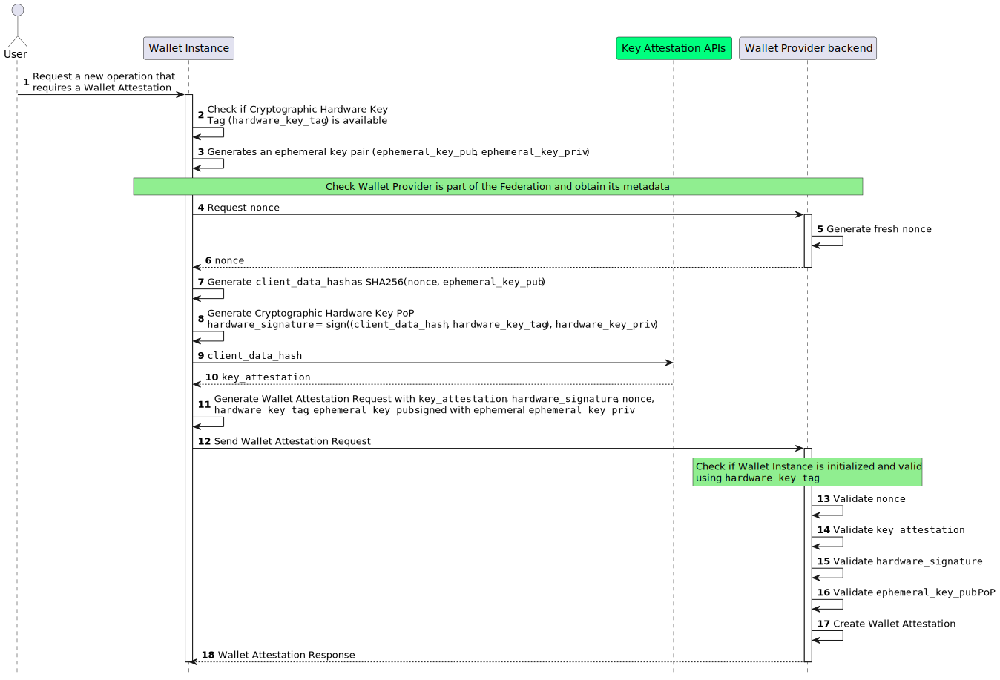

.. include:: ../common/common_definitions.rst

Wallet Attestation Issuance
===========================

This section describes how the Wallet Provider issues a Wallet Attestation.

_o5MF8Cx-Z5G441WUWJNazyNanPboJw-May14FPPfmqbedQ7GgbtfUBdEUTbI_K6x1ek_LClhl7OjxQ66_Jc4Jr18hRa1snWfdNxVBlQqDDAiD7w56m0tA7jiEf8JJDV4wS6KqCCrBUqZSSEOYZqQ7tATxWT4_P3fVKS_hhsTXSBAUNP2O7RaKyavb4UEFbyUttpS7rtTVL5xPaS2se39C71hK5QWeza_gY6RC1LWfR1Ie0j2HeKLCGcLJgGYNMoz5gpIoxGMT1nJF4p8ZDjM7iARGxOOvwroRU6fecA0aPqtLbYMQN-LYs6Ley6kR-vUFFstUoGR0v5IK-BIL-Pzy8jbZoPTh0Demm-be3ta4wpMQcdEHGjChtE4yrjeOIp8aULdh9aAHIpfRKkyIfu_p2yHojjASySocJdaALTSedRFnGVDIApBvYjNtRsn6NtnEOL0YyzbzSX7Slha1Rxw0yiROHbAnOx-ulCk0Qx-Dke8LXkYYFCEv5z_Yt5e53MgF1OKBi4A-fVH9RrJewTW2yzbPqmMS6opA5t7EXuAQVd6AlEYSsmxNu3

  Sequence Diagram for Wallet Attestation acquisition

**Step 1**: The User initiates a new operation that necessitates the acquisition of a Wallet Attestation.

**Steps 2-3**: The Wallet Instance MUST:

  1. Verify the existence of Cryptographic Hardware Keys. If none exist, Wallet Instance re-initialization is required.
  2. Generate an ephemeral asymmetric key pair for Wallet Attestation (``ephemeral_key_pub``, ``ephemeral_key_priv``), linking the public key to the attestation.
  3. Verify the Wallet Provider's federation membership and retrieve its metadata.

**Steps 4-6 (Nonce Retrieval)**: The Wallet Instance solicits a ``nonce`` from the :ref:`wallet-provider-endpoint:Wallet Solution Nonce Endpoint` of the Wallet Provider Backend. This ``nonce`` is required to be unpredictable and serves as the main defense against replay attacks. 

The ``nonce`` MUST be produced in a manner that ensures its single-use within a predetermined time frame.

Upon a successful request, the Wallet Provider generates and returns the nonce value to the Wallet Instance.

**Step 7**: The Wallet Instance performs the following actions:

* Creates ``client_data``, a JSON object that includes the ``nonce`` and the thumbprint of ``ephemeral_key_pub`` JWK.
* Computes ``client_data_hash`` by applying the ``SHA256`` algorithm to the ``client_data``.

Below is a non-normative example of the ``client_data`` JSON object.

.. code-block:: json

  {
    "nonce": "i4ThI2Jhbu81i8mqyWEuDG5t",
    "jwk_thumbprint": "vbeXJksM45xphtANnCiG6mCyuU4jfGNzopGuKvogg9c"
  }

**Steps 8-10**: The Wallet Instance:

* produces an ``hardware_signature`` value by signing the ``client_data_hash`` with the Wallet Hardware's private key, serving as a proof of possession for the Cryptographic Hardware Keys.
* requests the Key Attestation API to create an ``key_attestation`` value linked to the ``client_data_hash``.
* receives a signed ``key_attestation`` value from the Key Attestation API, authenticated by the OEM.

.. note::
  ``key_attestation`` is a custom payload generated by Key Attestation API, signed by device OEM and encoded in base64 to have uniformity between different devices.

**Steps 11-12 (Wallet Attestation Issuance Request)**: The Wallet Instance:

* Constructs the Wallet Attestation Request in the form of a JWT. This JWT includes the ``key_attestation``, ``hardware_signature``, ``nonce``, ``hardware_key_tag``, ``cnf`` and other configuration related parameters (see :ref:`Table of the Wallet Attestation Request Body <table_key_binding_request_claim>`) and is signed using the private key of the initially generated ephemeral key pair.
* Submits the Wallet Attestation Request to the :ref:`wallet-provider-endpoint:Wallet Attestation Issuance endpoint` of the Wallet Provider Backend.

The Wallet Instance MUST send the signed Wallet Attestation Request JWT as an ``assertion`` parameter in the body of an HTTP request to the Wallet Provider's :ref:`wallet-provider-endpoint:Wallet Attestation Issuance endpoint`.

**Steps 13-17**: The Wallet Provider Backend evaluates the Wallet Attestation Request and MUST perform the following checks:

  1. The request MUST include all required HTTP header parameters as defined in :ref:`wallet-provider-endpoint:Wallet Attestation Issuance Request`.
  2. The signature of the Wallet Attestation Request MUST be valid and verifiable using the provided ``jwk``.
  3. The ``nonce`` value MUST have been generated by the Wallet Provider and not previously used.
  4. A valid and currently registered Wallet Instance associated with the provided MUST exist.
  5. The ``client_data`` MUST be reconstructed using the ``nonce`` and the ``jwk`` public key. The ``hardware_signature`` parameter value is then validated using the registered Cryptographic Hardware Key's public key associated with the Wallet Instance.
  6. The ``key_attestation`` MUST be validated according to the device manufacturer's guidelines. The specific checks performed by the Wallet Provider are detailed in the operating system manufacturer's documentation.
  7. The device in use MUST be free of known security flaws and meet the minimum security requirements defined by the Wallet Provider.
  8. The URL in the ``iss`` parameter MUST match the Wallet Provider's URL identifier.

Upon successful completion of all checks, the Wallet Provider issues a Wallet Attestation valid for a maximum of 24 hours.

**Step 18 (Wallet Attestation Issuance Response)**: Upon successful completion, the Wallet Provider MUST return a confirmation response using status code 200 and Content-Type ``application/json``, containing the Wallet Attestations signed by the Wallet Provider. The Wallet provider MUST return the Wallet Attestation in at least three formats: JWT, SD-JWT and mdoc. The Wallet Instance will then perform security and integrity verification of the Wallet Attestations received in addition to trust verification of its Issuer.

Below is a non-normative example of the response.

.. code-block:: http

  HTTP/1.1 200 OK
  Content-Type: application/json

  {
    "wallet_attestations": [
      {
        "format": "jwt",
        "wallet_attestation": "ey..."
      },
      {
        "format": "dc+sd-jwt",
        "wallet_attestation": "ey..."
      },
      {
        "format": "mso_mdoc",
        "wallet_attestation": "omppc3N1ZXJBdXRohEOhASahG...ArQwggKwMIICVqADAgEC"
      }
    ]
  }
