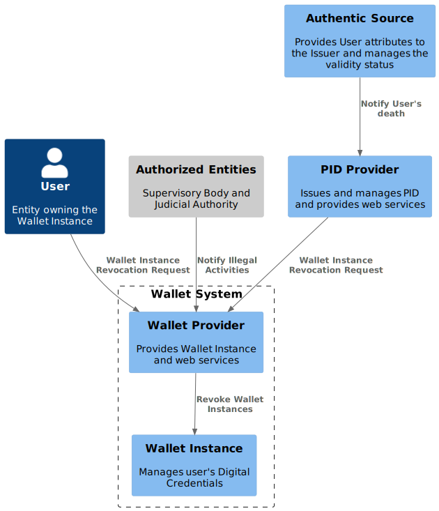

.. _wallet-revocation.rst:

Wallet Instance Revocation
~~~~~~~~~~~~~~~~~~~~~~~~~~~~~~~~~~~~~~~~~

This section describes the involved entities and modalities to request a Wallet Instance revocation.

The Wallet Provider MUST ensure the security and reliability of Wallet Instances, keeping them updated and compliant with security requirements. When, for technical security reasons (e.g., relating to the compromise of cryptographic material) the security of the Wallet Instance is compromised, the Wallet Provider MUST revoke the Wallet Instance.

As shown in :numref:`fig_Wallet_Instance_Revoc_Entities`, other actors MAY trigger the Wallet Instance revocation process:

- **Users**, connecting to the Wallet Provider’s web portal from their Wallet Instance or using an external browser.
- **PID Providers** when notified by the Authentic Source of the PID (ANPR) of the User’s death.
- **Legal Authorities or the Supervisory Body** in cases of proven illegal activities.

.. _fig_Wallet_Instance_Revoc_Entities:
WIVtNbbh29QEyxhMJ9XyvvFJAWpJO_wlYGCxTymlRpVvFhc2RnNmvnpdz1wBbZ0kr1cIxxroQcSYIBx_8ooGsw4ip8FHh8FAHixnL-q--0DghkealIh0IRhS8rnOWt8QZcOBR7d0reZ3zwhwPQ0IxSMyRQ9F8QT_UO9Waw6HXpGM5570RIA-ayzTNSQOJCYENQbKu8Eog6K0d8YI13YxD_MNdmbymAz6Drkl1mbmHY3F3aqyPTYaNWg9FWnmnw-ps-kaiKLbeH1fO9FVQiGSJ2fOBaQTowdZ7wdbcTnBr-Db0wjgRMpPiei1ZOSFQtFmhIBqZdz-PYyI2L4OSSUR9EHFvdAg4a84fB1_3J5UW7Extdh2ZuECMzRroMcZQ5-iHrCRPoZq9UCx6KvBU432dFxME9qw-mC0

    Entities involved in the Wallet Instance revocation process.

.. note::

  - The flow for the Wallet Instance Revocation triggered by the User is detailed below.
  - The endpoint used by the PID Provider is detailed in the Wallet Provider Catalogue of e-Service PDND Catalogue (see Section :ref:`wp-catalogue` for technical details).
  - The flow for Authorized Entities (e.g., Supervisory Bodies) is out of scope of this specification, it will be managed by each Wallet Provider.

Wallet Instance Revocation Request
...................................

Users MAY request the Wallet Instance revocation by:

- *Selecting the revocation functionality from their Wallet Instance*: this functionality may be used by Users before changing their phone.
- *Using an external user agent*: this covers cases where Users lose their device, and so their access to their Wallet Instance.

In both cases, by using the Wallet Provider portal:

- Users MUST authenticate with at least a second-factor authentication mechanism, or have an active session that meets this requirement.
- The Wallet Provider MUST allow Users to view the state of their Wallet Instances associated with their authenticated session and ask for revocation, sending a Wallet Instance Retrieval or Revocation Request, as applicable, to the :ref:`Wallet Instance Management endpoint` of the Wallet Provider Backend.

Below is a non-normative example of a Wallet Instances Retrieval Request.

.. code:: http

   GET /wallet-instances HTTP/1.1
   Host: walletprovider.example.com

Upon a successful retrieval, the Wallet Provider MUST return a confirmation response, with the status of all Wallet Instances associated with the User.
Below is a non-normative example of a Wallet Instances Retrieval Response.

.. code:: http

   HTTP/1.1 200 OK
   Content-Type: application/json
   Cache-Control: no-store

   [
     {
       "id": "f7b2a8d9",
       "status": "ACTIVE",
       "issued_at": "2024-03-12T10:00:00Z"
     },
     {
       "id": "g8b235c4",
       "status": "REVOKED",
       "issued_at": "2024-02-28T15:30:00Z"
     }
   ]

Once the User identifies the Wallet Instance to be revoked, a Wallet Instance Revocation Request can be sent to the endpoint, including the Wallet Instance ID as a path parameter.
Below is a non-normative example of a Wallet Instance Revocation Request.

.. code-block:: http

    PATCH /wallet-instances/{f7b2a8d9} HTTP/1.1
    Host: wallet-provider.example.org
    Content-Type: application/json

    {
      "status": "REVOKED"
    }

Wallet Instance Revocation Response
...................................
Upon a successful revocation, the Wallet Provider MUST return a confirmation response.
Below is a non-normative example of a Wallet Instance Revocation Response.

.. code-block:: http

   HTTP/1.1 204 No Content

Revocation Check Mechanisms
...................................

The verification of the Wallet Instance validity MUST be performed:

- **During Digital Credential issuance or presentation phase** by the Credential Issuers and Relying Parties, respectively. Only Wallet Instances in Operational or Valid state have valid Wallet Attestations. Thus, the verification of the validity of a Wallet Instance is indirectly performed by Credential Issuers and Relying Parties by checking the presence of a valid Wallet Attestation (i.e. not expired and signed by a trusted Wallet Provider). During proximity presentation the Wallet Instance might not be able to fetch a fresh Wallet Attestation, in this case, the Wallet Instance SHOULD send the latest version of the Wallet Attestation. It is left up to the Relying Party to determine whether a presentation with a valid but expired Wallet Attestation is valid or not.

- **During the validity period of the Digital Credential**  by the Credential Issuers. Indeed, if the Wallet Instance is revoked, the PID hosted within it MUST be revoked. Any other Digital Credential obtained through the presentation of the PID MUST therefore be revoked too. In the current version of the specification, Credential Issuers are directly notified of a Wallet Instance revocation by the Wallet Provider using a PDND e-service.

.. note::
   With the introduction of the **Wallet Trust Evidence (WTE)**, this section will be updated accordingly.

