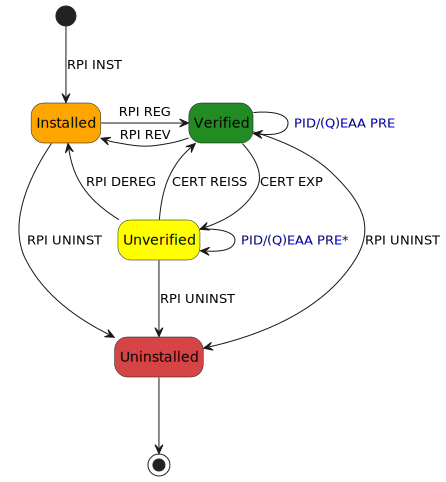

.. include:: ../common/common_definitions.rst

.. "included" file, so we start with '-' title level

Relying Party Instance
----------------------

The Relying Party Instance (RPI) is a mobile or embedded application designed to request, receive, and process Digital Credentials from Wallet Instances in a trusted manner. Each RPI ensures the integrity, confidentiality and authenticity of Credential exchanges, enabling secure interactions between Users and Relying Parties.

There are two primary types of Relying Party Instances, each serving different operational environments:

- **Embedded Relying Party Instance**: an hardware/software solution running on a specialized device (e.g., turnstiles). Each instance corresponds to a specific installation of the application on an embedded device. Since the trust with the Embedded Relying Party Instance is established through the trust established with the Mobile Relying Party Provider, the Embedded Relying Party Instance can be considered a confidential client.
- **Mobile Relying Party Instance**: a native application running on a mobile device (e.g., smartphone or tablet). Each instance corresponds to a specific installation of the application on a device. Since the trust with the Mobile Relying Party Instance is established through the trust established with the Mobile Relying Party Provider, the Mobile Relying Party Instance can be considered a confidential client.
- **Web Relying Party Instance**: a remote application operated by the Relying Party. A Web Relying Party Instance operates as a confidential client, meaning it can securely store confidential configurations (such as its private cryptographic keys) on a remote server. In this context, the Relying Party is unprovisioned and the presentation request and validation is automatically handled by software.

.. note::
  Mobile and Embedded Relying Party Instances acting as public clients are not considered within these specifications.

.. note::
  Unlike the Web Relying Party Instance, a Mobile and Embedded Relying Party Instance requires proper lifecycle management and special registration procedures managed through the Relying Party Backend.

Further technical and operational details are discussed in the following sections.

Mobile Relying Party Instance
-----------------------------

A Mobile Relying Party Instance's lifecycle includes four main states: **Installed**, **Unverified**, **Verified**, and **Uninstalled**, supporting functionalities such as registration, Access Certificate reissuance, and revocation.

Mobile Relying Party Instance Lifecycle
^^^^^^^^^^^^^^^^^^^^^^^^^^^^^^^^^^^^^^^

In this section, state machines are presented to explain the Mobile Relying Party Instance states, as well as their transitions and relations.

.. _fig_RelyingParty_Instance_Mobile_Lifecycle:
zVuWHfz9-tirnr0IK_NVYT6T0MpyV5_8el8-P8D-50QJcvTRkbn2nEXyqXxvlMQx8G-UADi0VOs87LurF4URqegqMOo6SNoEz0elsuuwNSjVsaD0JmkrWXhKaBvCNL2B7_JkN7y-ENtvP84vRpBv2m00

    Lifecycle of the Mobile Relying Party Instance

As shown in :numref:`fig_RelyingParty_Instance_Mobile_Lifecycle`, the Mobile Relying Party Instance has four distinct states: **Installed**, **Unverified**, **Verified**, and **Uninstalled**. Each state represents a specific functional status and determines the actions that can be performed.

Transition to Installed
"""""""""""""""""""""""

The state machine begins with the Relying Party Instance installation (**RPI INST** transition), where Users download and install a Relying Party Instance using the official app store of their device's operating system, leading to the **Installed** state.

While in this state, the Relying Party Instance MUST interact only with the Relying Party Backend to be registered (i.e., to verify the Instance integrity, register Hardware Cryptographic Keys and obtain an Access Certificate).

When the revocation of the Relying Party Instance occurs (**RPI REV** transition), the Relying Party Instance MUST get back from **Unverified** to **Installed**. This transition implies the following operations:

1. The Access Certificate MUST be revoked.
2. The Hardware Cryptographic Keys MUST be deleted.

Revocation can occur in the following cases:

- For security reasons (e.g., compromise of cryptographic material).
- For technical reasons (e.g., deprecation of the Relying Party Solution).
- In case of Relying Party de-registration (as detailed in `EIDAS-ARF`_, Section 6.4.3).
- Illegal activities reported by Judicial or Supervisory Bodies.

In addition, each Relying Party SHOULD set an amount of time (grace period) during which the Relying Party Instance can request presentations of Digital Credentials by authenticating itself towards a Wallet Instance using an expired Access Certificate. After this period, the Relying Party Instance MUST be de-registered (**RPI DEREG** transition) and go back to the **Installed** state. This transition implies that the Hardware Cryptographic Keys MUST be deleted.

Transition to Verified
""""""""""""""""""""""

The Relying Party Instance needs to obtain a proper Access Certificate, which will be used to authenticate itself towards Wallet Instances. This Certificate is obtained by interacting with the Relying Party Backend, which in turns communicates with the Relying Party Instance Access Certificate Authority. Specifically, the registration transition (**RPI REG**) consists of the following subphases, leading to the **Verified** state:

1. **Initialization**: After verification of the Relying Party Instance integrity, it registers a pair of Hardware Cryptographic Keys.
2. **Access Certificate Issuance**: The Relying Party Instance obtains an Access Certificate.

In case the Access Certificate is expired, a new Certificate can be issued to the Relying Party Instance; this operation is represented by the **CERT REISS** transition towards the **Verified** state.

While in this state, the Relying Party Instance can request the presentation of Digital Credentials to Wallet Instances (**PID/(Q)EAA PRE**), using the Access Certificate to authenticate itself.

Transition to Unverified
""""""""""""""""""""""""

The expiration of the Access Certificate (**CERT EXP** transition) leads to the **Unverified** state.

While in this state, the Relying Party Instance can still request the presentation of Digital Credentials to Wallet Instances during the grace period. However, as the Certificate is expired, a specific disclaimer MUST be displayed to the User of the Wallet Instance during the presentation flow; for this reason, this operation is represented by the label **PID/(Q)EAA PRE**. This is required to support offline presentation flows. After the grace period has passed, the Relying Party Instance MUST NOT longer request presentations and will be de-registered.

Transition to Uninstalled
"""""""""""""""""""""""""

Across the **Installed**, **Verified** and **Unverified** states, the Relying Party Instance can be removed entirely through the Relying Party Instance uninstall (**RPI UNINST**) transition, leading to the **Uninstalled** state. If a Relying Party Instance is **Uninstalled**, it ends its lifecycle.

Mobile Relying Party Instance Functionalities
^^^^^^^^^^^^^^^^^^^^^^^^^^^^^^^^^^^^^^^^^^^^^

A Mobile Relying Party Instance MUST support three fundamental functionalities: **Registration**, **Access Certificate Reissuance**, and **Revocation**. Each functionality is described in detail in the following sections.

.. note::
  Throughout this section, the services used to attest genuineness of the Relying Party Instance and the device in which it is installed are referred to as **Key Attestation API**. The Key Attestation API is considered in an abstract fashion and it is assumed to be a service provided by a trusted third party (i.e., the OS Provider's API) which is able to perform integrity checks on the Wallet Instance as well as on the device where it is installed.

.. note::
  The details provided below are non-normative and are intended to clarify the functionalities of the Mobile Relying Party Instance. The actual implementation may vary based on the specific use case and requirements of the Relying Party.

Mobile Relying Party Instance Registration
""""""""""""""""""""""""""""""""""""""""""

This process allows for the registration of a Relying Party Instance with the Relying Party Backend, and the issuance of an Access Certificate that will be used for authentication purposes towards Wallet Instances during presentation flows. The process consists of two subphases:

1. **Initialization**: The Relying Party Instance requests a security and integrity assertion from the OS manufacturer, which also binds a long-lived key pair stored in a proper secure storage within the device itself; the assertion is then validated by the Relying Party Backend. Further details are provided in Section :ref:`mobile-application-instance:Mobile Application Instance`.
2. **Access Certificate Issuance**: The Relying Party Instance requests an Access Certificate from the Relying Party Backend. Before interacting with the Relying Party Instance Access Certificate Authority for the issuance of the Access Certificate, the Relying Party Backend validates the Relying Party Instance's integrity and security by leveraging the long-lived, attested keys generated in the previous subphase. The flow is displayed in :numref:`fig_RelyingParty_Instance_Mobile_Registration_AccessCertificateIssuance`, while a step-by-step description is provided below.

.. note::
  Access Certificates MAY be issued as short-lived (typically valid within 24 hours) or long-lived.

.. _fig_RelyingParty_Instance_Mobile_Registration_AccessCertificateIssuance:
dnTRQqqnmfg4FHgDJ50FtBbWU9mxQPGCTljwkuVrqtQ_-RnPr_kdIeRu-4aUArXtfCzWZh0EesTt2kWxe-4hXlON1W8PBiBqWbSqFJOzLJVgBsGf89CWS9OOF9e0xvIIzuCV6gK-GFedcAjIxvDMvbj9nZy7YYo0TLEuQleyvefCy_poDuFvaapEnMGX7xQqQ52mAR3k3La-jCYe5A1jNwns5p_S5myTnawQfYx8SLK4ikc94LoUsTeqEkRLo2QpeEYoI_4VeZbPv278V4Lqshr7OzjfELAWjncNowMOqoP4SBQiof7VrQDtDj8hqb-iwKu6k-a_BOsEuMv5qjdIST5o8bDHOq6hiQeqpiNvzgoHqtyNuloBEkXiTVdHD2wY-B-W4CQENQ1No0Ik7iYsmwN_0m00

    Flow of the Mobile Relying Party Instance Access Certificate Issuance

**Steps 1-2:** The Mobile Relying Party Instance:

  1. Verifies the existence of Cryptographic Hardware Keys. If none exist, the Relying Party Instance re-initialization is required.
  2. Generates an asymmetric key pair for the Access Certificate (``key_pub``, ``key_priv``).

**Steps 3-5:** The Mobile Relying Party Instance requests a ``nonce`` from the :ref:`relying-party-endpoint:Relying Party Nonce Endpoint` of the Relying Party Backend. This ``nonce`` MUST be unpredictable to serve as the main defense against replay attacks.

Upon a successful request, the :ref:`relying-party-endpoint:Relying Party Nonce Endpoint` generates and returns the ``nonce`` to the Mobile Relying Party Instance. The :ref:`relying-party-endpoint:Relying Party Nonce Endpoint` MUST ensure that it is single-use and valid only within a specific time frame.

Non-normative examples of the Nonce Request and Response can be found in the :ref:`mobile-application-instance:Mobile Application Nonce Request` and :ref:`mobile-application-instance:Mobile Application Nonce Response` sections, respectively.

**Step 6:** The Mobile Relying Party Instance:

  1. Generates ``client_data``, a JSON object that includes the challenge and the thumbprint of ``key_pub``, obtained from its ``JWK`` representation.
  2. Computes ``client_data_hash`` by applying the SHA256 algorithm to ``client_data``.

Below is a non-normative example of the ``client_data`` JSON object.

.. code-block:: json

    {
      "nonce": "f3b29a81-45c7-4d12-b8b5-e1f6c9327aef",
      "jwk_thumbprint": "hT3v7KQjFZy6GvDkYgOZ1u2F6T4Nz5bPjX8o1MZ3dJY"
    }

**Steps 7-8:** The Mobile Relying Party Instance:

  1. Requests the Key Attestation APIs to create a ``key_attestation`` value linked to the ``client_data_hash``.
  2. Receives a signed ``key_attestation`` value from the Key Attestation APIs, authenticated by the OEM.

**Steps 9-11:** The Mobile Relying Party Instance:

  1. Generates an ``hardware_signature`` value by signing the ``client_data_hash`` with the Hardware Cryptographic private key, serving as a proof of possession for the Cryptographic Hardware Keys.
  2. Generates the :ref:`relying-party-endpoint:Relying Party Key Binding Request` in the form of a JWT. This JWT includes ``key_attestation``, ``hardware_signature``, ``nonce``, ``hardware_key_tag``, and ``cnf`` (representing ``key_pub``); it is signed using ``key_priv``.
  3. Sends the signed :ref:`relying-party-endpoint:Relying Party Key Binding Request` JWT as an ``assertion`` parameter in the body of an HTTP request to the :ref:`relying-party-endpoint:Relying Party Key Binding Endpoint`.

**Step 12:** The Relying Party Backend evaluates the Key Binding Request and performs the following checks:

  1. The request includes all required HTTP header parameters as defined in :ref:`relying-party-endpoint:Relying Party Key Binding Request`.
  2. The signature of the Key Binding Request is valid and verifiable using the provided ``jwk``.
  3. The ``nonce`` value has been generated by the Relying Party Backend and not previously used.
  4. The Relying Party Instance has valid Cryptographic Hardware Keys registered.
  5. The ``client_data`` can be reconstructed using ``nonce`` and ``cnf`` (representing ``key_pub``). The ``hardware_signature`` parameter value is then validated using the registered Cryptographic Hardware Key's public key associated with the Relying Party Instance.
  6. The ``key_attestation`` can be validated according to the device manufacturer's guidelines. The specific checks performed by the Relying Party Backend are detailed in the operating system manufacturer's documentation.
  7. The device in use is free of known security flaws and meets the minimum security requirements defined by the Relying Party.
  8. The URL in the ``iss`` parameter matches the Relying Party's URL identifier.

**Step 13:** If the checks are successful, the Relying Party Backend responds with a confirmation of success (:ref:`relying-party-endpoint:Relying Party Key Binding Response`).

**Step 14:** The Mobile Relying Party Instance generates a Certificate Signing Request (CSR, ``csr``) using ``key_pub`` and ``key_priv``.

**Step 15:** The Mobile Relying Party Instance sends the CSR to the :ref:`relying-party-endpoint:Relying Party Access Certificate Endpoint` of the Relying Party Backend, as part of the :ref:`relying-party-endpoint:Relying Party Access Certificate Request`.

**Steps 16-17:** The Relying Party Backend checks that the public key in the CSR corresponds to a Relying Party Instance that has been previously validated, i.e., that it matches the one bound to the Cryptographic Hardware Keys through ``hardware_signature``. If this check is successful, the Relying Party Backend sends the CSR to the Relying Party Instance Access Certificate Authority.

**Steps 18-19:** The Relying Party Instance Access Certificate Authority signs the CSR, obtaining a valid Access Certificate (``access_certificate``) which it sends back to the Relying Party Backend.

**Steps 20-21:** The Relying Party Backend sends the Access Certificate (as part of the :ref:`relying-party-endpoint:Relying Party Access Certificate Response`) to the Mobile Relying Party Instance, which stores it for future authentication towards Wallet Instances.

Mobile Relying Party Instance Access Certificate Reissuance
"""""""""""""""""""""""""""""""""""""""""""""""""""""""""""

The issuance of a new Access Certificate follows the same flow described in the :ref:`relying-party-instance:Mobile Relying Party Instance Registration` section for **Access Certificate Issuance**. Those certificates MAY be issued as short-lived (typically valid within 24 hours) or long-lived.

Mobile Relying Party Instance Revocation
""""""""""""""""""""""""""""""""""""""""

Relying Parties MUST periodically verify the Relying Party Instance's authenticity and security.
When security issues are detected, Relying Parties MUST revoke the Relying Party Instance, revoking its X.509 Access Certificate (in case of long-lived certificates), and in any case, Relying Parties MUST NOT allow the re-issue of certificates.
As a result, Mobile Relying Party Instance revocation MUST be tied to X.509 Access Certificates validity.

Long-lived X.509 Certificates follows the requirements about their lifecycle, defined in :ref:`trust:The Infrastructure of Trust`.

Web Relying Party Instance
--------------------------

Web Instances operates server-side security controls that safely store secrets and cryptographic keys in a controlled environment. Web Instances MUST be registered with the Trust Anchor or Intermediary Entities, according to :ref:`trust:The Infrastructure of Trust`.

Web Relying Party Instance Functionalities
^^^^^^^^^^^^^^^^^^^^^^^^^^^^^^^^^^^^^^^^^^

A Web Relying Party Instance MUST support two fundamental functionalities: **Registration** and **Revocation**. Each functionality is described in the following sections.

Web Relying Party Instance Registration
"""""""""""""""""""""""""""""""""""""""

Web Relying Party Instances, as confidential clients, are registered directly with the Trust Anchor or an Intermediary Entity. The registration involves:

- The Relying Party MUST register its Web Instance with the Trust Anchor or Intermediary.
- The Relying Party MUST expose an Entity Configuration as defined in the Trust Framework.
- The Entity Configuration MUST contain all necessary metadata for federation, including endpoints and public keys.
- No individual instance lifecycle management is required, as the Web Instance operates as part of the secured server environment.

Web Relying Party Instance Revocation
"""""""""""""""""""""""""""""""""""""

When a Web Relying Party Instance needs to be revoked:

- The revocation MUST be performed according to the Trust Framework procedures.
- The cryptographic keys used by the Web Instance MUST be revoked.
- The Entity Configuration MUST be updated to reflect the revocation.
- The Trust Anchor MUST be notified of the revocation to update federation metadata.
