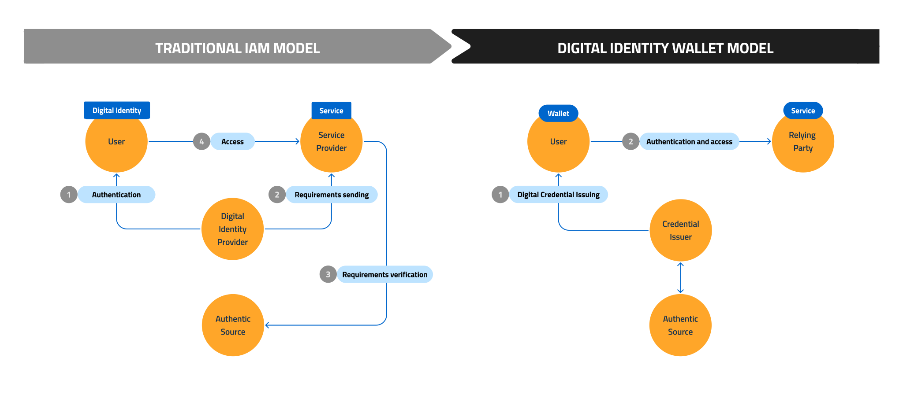

.. include:: ../common/common_definitions.rst

The Digital Identity Wallet Paradigm
====================================

The Digital Identity Wallet paradigm refers to a new architecture in Identity and Access Management (IAM) that enhances confidentiality and grants Users full control over the Digital Credentials used to access services.
Thanks to this new paradigm, the IT-Wallet System allows Users to maintain full control in the management and use of their information when accessing services provided by public and private entities.

The main difference between this new approach and the traditional IAM infrastructure is that the presentation of credentials or attributes doesn't require intermediaries between the Wallet Instance and the Relying Party, while in the SAML2 or OIDC based infrastructure a Digital Identity Provider is always involved, knowing which services the User is accessing to.

Digital Identity Wallet Architectures are significant in the field of digital identity governance. This new digital identity paradigm is designed for Users - be they citizens, Public Administrations, or private organizations- who want to access services using their national authentication systems.

The main roles in the Digital Identity Wallet ecosystem are listed as follow:

 - Issuers: parties who issue Digital Credentials for Users;
 - Verifiers: parties who request Digital Credentials from the User for Authentication and authorization purposes;
 - Holders: individuals who own a Wallet Instance and have control over the Digital Credentials they can request, acquire, store, and present to Verifiers;
 - Verifiable Data Registries: authorities that publish certificates, attestations, metadata, and schemes needed for allowing the trust establishment between the parties.

  
  *Evolution of IAM Model*

In this model, the credential issuer (e.g., an educational institution) provides Digital Credentials to the User, who can store them in their Wallet Instance.
The Wallet Instance is typically provided as a mobile application on the User's smartphone.

Other key elements that characterize this new Digital Identity Wallet paradigm include:

 - **Confidentiality and control**: Wallets enable individuals to maintain control over the information they share. They can choose what attributes or credentials to present, to whom, and for what purpose, in line with the Self-Sovereign Identity (SSI) approach;
 - **Security**: Wallets leverage cryptographic mechanism to ensure the integrity and security of identity information. It avoids the risk of identity theft, fraud, and unauthorized access since the data remains under the individual's control;
 - **Interoperability**: Wallets promote interoperability by enabling different systems and organizations to recognize and verify identities without relying on a central authority. This allows for seamless and trusted interactions between individuals, organizations, and even across borders;
 - **Efficiency and cost reduction**: Individuals can easily manage their own credentials, avoid handling multiple identity tokens, and reduce repetitive identity verification processes. This streamlines administrative procedures, reduces costs, and enhances the User Experience.
