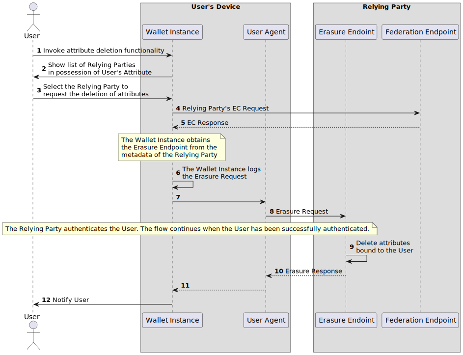

.. include:: ../common/common_definitions.rst

User's Attributes Deletion
==========================

This Wallet Instance functionality allows Users to obtain a list of all Relying Parties towards which attributes that can uniquely identify Users (e.g., the tax_id_code claim of the PID) have been presented. Subsequently Users may request deletion of all attributes presented to a Relying Party of their choice. Below the high level flow regarding this interaction is presented.

mVqxTxWnpqV-IO2gEVH52KQAL3ccaWR_m1ZC3pZSjtnx0ozxFa4Cei1JupoGm8yK4imiGYBEnDFrU4zNcLiRBwOwAEYUsZk0ij5b-bL8wdZrnzFgMbP_ddRJafZmzhqzLH93EWJkhz9r93Cd8RzEOYNW8sMVsc-0hwPwqp1mhnYIrBcxMXkw71wcp0UVLCI154TKDC__HpI4b-EwtHh3hRsg77dd5_vNT4csT8GRFp3wD_azNe4sKRsBjnMw96vhm6A2ISE0Ib8pUACF5Jb5Fi70Dat63IS3BWZOeq1FzY9b64XaAZ6sTED3Uu5gOtN-x7tJMhM7xxaONdcHMRPg-2LkKsp1fVFRV_CdrZ2TBqoFPgKSuXy0

    Sequence Diagram for Deletion of User's Attributes

**Step 1:** The User requests the deletion of attributes invoking the Wallet Instance's attribute deletion function.

**Step 2:** The Wallet Instance collects all transaction data and shows the User the list of Relying Parties with which it has had interactions throughout the Wallet Instance lifecycle and are in possession of User's attributes. The Wallet Instance SHOULD filter the transaction logs so that only the Relying Parties which have had access to attributes uniquely identifying the User are shown.

**Step 3:** The User selects the target Relying Party for attributes deletion.

**Steps 4 - 5:** The Wallet Instance obtains the Relying Party Entity Configuration at the Federation ./well-known/ endpoint. The URL or the Erasure Endpoint (``erasure_endpoint``) can be found inside the metadata parameter.

**Step 6:** The Wallet Instance logs the Erasure Request's relevant information. These logs MUST include at least:
  * the date of request,
  * the Relying Party to which the request was made,
  * the attributes requested to be removed.

**Steps 7 - 8:** The Wallet Instance redirects the User to the Erasure Endpoint. It MUST also ensure that a callback mechanism to allow the User-Agent to notify the Wallet Instance (and thus the User) after the Erasure Response is present. Details on the Erasure Request can be found in :ref:`relying-party-endpoint:Erasure Request`.

.. note::
  The Relying Party web page will authenticate the User with an appropriate Level of Assurance using any method such as SPID/CIE or the PID presentation. The specific mechanism used for authentication is left to the Relying Party. Upon authenticating the User, the Relying Party MAY prompt the User to perform additional steps needed for the deletion of attributes, e.g., it might require the User to confirm the deletion operation.

**Step 9:** Upon successful authentication of the User the Relying Party MUST delete all attributes bound to the User in its possession.

**Step 10:** The Relying Party returns the Erasure Response in the form of an HTTP Response to the User-Agent and includes the callback URL if provided in the Erasure Request. Details on the Erasure Response can be found in :ref:`relying-party-endpoint:Erasure Response`.

**Steps 11 - 12:** The User-Agent uses the implemented method to return the Erasure Response to the Wallet Instance. Finally, the User is notified via the Wallet Instance regarding the Erasure Response outcome.
