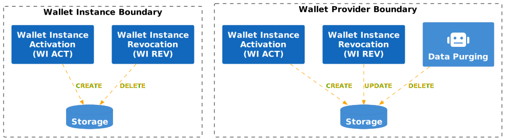

.. include:: ../common/common_definitions.rst

Wallet Instance Lifecycle
=========================

The Wallet Provider is in charge of the implementation and provision of Wallet Instances also handling their entire lifecycle.

In this section, state machines are presented to explain the Wallet Instance and Digital Credential states and their transitions and relations.

.. note::
  PID is a specialized Digital Credential type that has impacts on the Wallet Instance's lifecycle. The revocation of the PID MAY also have potential impacts on (Q)EAAs, if they were issued using the presentation of the PID.
  When the distinction between PID and (Q)EAA is not needed, the term Digital Credential is used.

As shown in :numref:`fig_Wallet_Instance_States`, the Wallet Instance has four distinct states: **Installed**, **Operational**, **Valid**, and **Uninstalled**.
Each state represents a specific functional status and determines the actions that can be performed.

.. _fig_Wallet_Instance_States:
K5m_xcpWWctLAF6IhaUaET_V5AAel5VHiE3axfI68SHfQYTBwjkT51pCrltMlmv97BNjkFKR0wifZT5c7trCxDz6U9POrelO4RqvP3jU6n4egB4gnQlYiJWLKf7fyUF14bWQrHTBHwZv9_FEBmBVRhy2CcCorrV-2m00

    Wallet Instance Lifecycle.

.. note::
  The Wallet Provider MUST ensure the security and reliability of the Wallet Instances. To achieve this, the Wallet Provider MUST periodically check the Wallet Instances security and compliance status.

Transition to Installed
"""""""""""""""""""""""""

The state machine begins with the Wallet Instance installation (**WI INST**) transition, where Users download and install a Wallet Instance provided by the Wallet Provider using the
official app store of their device's operating system (this ensures authenticity via system checks), leading to the **Installed** state.

When the state is **Installed**, the Wallet Instance MUST interact only with the Wallet Provider to be activated. When the revocation of the Wallet Instance occurs, the Wallet Instance MUST go back from **Operational** or **Valid** to **Installed**. The revocation marks the Wallet Cryptographic Hardware Key, registered during activation
(see :ref:`wallet-instance-lifecycle:Transition to Operational`), as not usable anymore. Revocation can occur in the following cases:

* for technical security reasons (e.g., relating to the compromise of cryptographic material);
* in case of explicit User requests (e.g., due to loss, or theft of the Wallet Instance);
* death of the User;
* illegal activities reported by Judicial or Supervisory Bodies.

.. note::
  While for the ARF the revocation of the Wallet Instance is accomplished by revoking the Wallet Attestation (see Topic 9 and Topic 38 in Annex 2),
  in this specification the revocation is managed differently. Being the Wallet Attestation short-lived, it does not have a status management mechanism.
  For this reason, the Wallet Instance revocation transition is accomplished by deleting the Wallet Cryptographic Hardware Key from the WSCD of the Wallet
  Instance and from the account associated with the User. This transition is completed when the Wallet Instance is online.

Transition to Operational
"""""""""""""""""""""""""""

After installation, the User opens the Wallet Instance and an activation begins (**WI ACT**).
At this stage, a User account MUST be created with the Wallet Provider and associated with the Wallet Instance through the Wallet Cryptographic
Hardware Key Tag, subject to obtaining the User's consent (see :ref:`wallet-instance-registration:Wallet Instance Initialization and Registration` for more details).
This association allows the User to directly request Wallet Instance revocation from the Wallet Provider, and it also allows the Wallet Provider to
revoke the Wallet Instance associated with that User.

.. note::
  As a result of the User account creation, an authentication mechanism MUST be set for the User to interact with the Wallet Provider portal.
  This specification mandates the use of at least a second-factor for User authentication.

As part of the activation, the Wallet Provider MUST evaluate the operating system and general technical capabilities of the device to check compliance
with the technical and security requirements, and the authenticity and integrity of the installed Wallet Instance.
Upon successful verification, the Wallet Provider MUST issue at least one valid Wallet Attestation to the Wallet Instance, therefore the Wallet Instance enters the **Operational** state.

In addition, if not already done, Users MUST set their preferred method of unlocking their Wallet Instance; this MAY be accomplished by entering a
personal identification number (PIN) or by utilizing biometric authentication, such as fingerprint or facial recognition, according to personal
preferences and device's capabilities. Please refer to :ref:`wallet-attestation-issuance:Wallet Attestation Issuance`.

In the **Operational** state, Users can request the issuance of PID (**PID ISS**) or (Q)EAAs if the PID is not required in the issuance
(**(Q)EEA ISS**). In addition, if the Digital Credentials are (Q)EEAs and for the presentation they do not require the PID, they can be presented
without transitioning the Wallet Instance to another state (**(Q)EEA PRE** transition).

A **Valid** Wallet Instance MUST transition back to the **Operational** state due to **PID EXP/REV/DEL** transition, when the associated PID expires, is revoked by its Provider or either deleted by the User.

Transition to Valid
"""""""""""""""""""""

A transition to the Valid state occurs only when the Wallet Instance obtains a valid PID (**PID ISS**). In this state, Users can obtain and present
new (Q)EAAs (**(Q)EAA ISS/PRE**), and present the PID (**PID PRE**). Please refer to :ref:`credential-issuance:Digital Credential Issuance` and :ref:`credential-presentation:Digital Credential Presentation`.

.. note::
  Users can have only one Wallet Instance in **Valid** state for the same Wallet Solution. Thus, when a User installs and obtains a PID on a new Wallet
  Instance of the same Wallet Solution from the same Wallet Provider, the PID in the previous Wallet Instance MUST be revoked and the Wallet Instance became
  **Operational**.

Transition to Uninstalled
"""""""""""""""""""""""""""

Across all states, **Installed**, **Activated**, **Operational**, or **Valid**, the Wallet Instance can be removed entirely through the Wallet Instance
uninstall (**WI UNINST**) transition, leading to the **Uninstalled** state. If a Wallet Instance is **Uninstalled** it ends its lifecycle.

Wallet Instance Lifecycle Management
"""""""""""""""""""""""""""""""""""""

While :numref:`fig_Wallet_Instance_States` shows the different states a Wallet Instance may acquire during its lifecycle,
:numref:`fig_Wallet_Instance_Lifecycle` shows the point of view of Wallet Instances and Wallet Providers in managing the Wallet Instance lifecycle
and the effect on their local storage.

.. _fig_Wallet_Instance_Lifecycle:
UUMlo0F25qoKK7hZAyra0sueRFVYiC2B0B8XAJCdu3ix2KBR-bODaZDz2OPgHVm34mAGRAL19ciWrrK_95yzuX5INAn85x3wyq8whh4T6RPAaayoE6n9d9IXRuD--0lb81RG74PLtw8v_N15BJkVMbe5PuDAh_p2Vba3SxttpRkngMziCgt6beE-ixd-K0FoVrqqZF_cSgSocP3VLEP8q0zkFMN8I3ReffND55ezc5wt21jVgqgXXPny3k87yBCsfJjQqWbmhuKrPkDUJkY2pdeE9ZcD5uDJShhhyv-YBZbTxVblTjSmphk_PEbovHD8FdJYEm00

    Wallet Instance Lifecycle Management.

Through a Wallet Instance in an **Installed** state, a User is able to start the **Wallet Instance Activation** (**WI ACT**).
As a result, the Wallet Instance MUST create a Wallet Cryptographic Hardware Key pair. In addition, if not already done,
Users MUST set their preferred method of unlocking their Wallet Instance. As a result of the **Wallet Instance Revocation** (**WI REV**), the Wallet Instance MUST
delete the Wallet Cryptographic Hardware Key pairs.

A Wallet Provider instead is responsible for:

* **Wallet Instance Activation** (**WI ACT**): a User account MUST be created and associated with the Wallet Instance through the Wallet Cryptographic Hardware Key Tag. As a result of the User account creation, an authentication mechanism of at least two factors MUST be set for the User to interact with the Wallet Provider portal.
* **Wallet Instance Revocation** (**WI REV**): for technical security reasons or triggered by external entities (e.g., Users and Supervisory Bodies) the Wallet Cryptographic Hardware Key Tag MUST be deleted from the User account.
* **Data Purging**: through an explicit request of Users, the User account at the Wallet Provider MUST be removed from the local storage.
